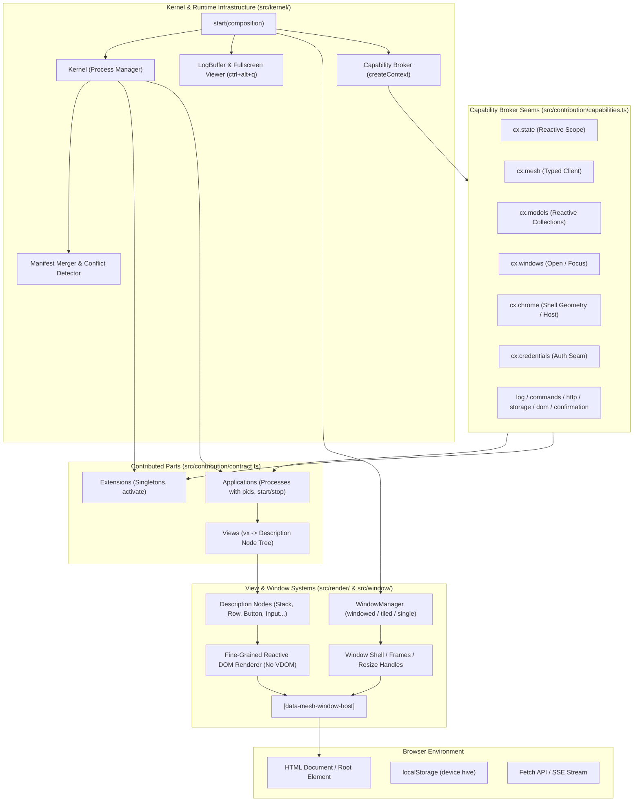

# @flybyme/mesh-web Documentation

> The browser half of the mesh framework: an abstract operating system in a browser.

`@flybyme/mesh-web` provides the client runtime for the Mesh architecture. Rather than treating a web application as a monolithic bundle of React/Vue components, `@flybyme/mesh-web` models the browser runtime as an **abstract operating system**: a sandboxed kernel that boots compositions of modular parts, enforces capability narrowing, orchestrates fine-grained reactive DOM rendering without virtual DOM diffing, manages multi-window tiling and desktop shells, and bridges typed RPC calls to the backend cluster without allowing the browser to join the mesh network directly.

---

## Foundational Invariants

The entire framework is governed by strict architectural invariants:

1. **Strict Browser Sandbox — Zero Node Builtins**:
   Nothing in `@flybyme/mesh-web` may import a Node.js builtin module. The package's [`tsconfig.json`](file:///home/ubuntu/code/mesh-web/tsconfig.json) sets `"types": []`, and any import of `fs`, `path`, `crypto`, or `process` is a compilation failure.
2. **The Browser Never Joins the Mesh**:
   The browser communicates exclusively via HTTP/SSE with a cluster node's API gateway (`mesh-api` / `mesh-serve`). Running an active mesh node or peer-to-peer WebSocket transport in a browser tab would make every browser an unvetted peer on the internal cluster network.
3. **Framework Singleton Integrity**:
   A running page must resolve the framework to exactly one copy. If a bundler or import map serves `@flybyme/mesh-web` under multiple distinct URLs, multiple reactive scopes and capability brokers run concurrently. The framework tracks evaluation URLs on `globalThis` using `Symbol.for('@flybyme/mesh-web/instances')` and verifies singleton execution via [`assertSingleFramework()`](file:///home/ubuntu/code/mesh-web/src/instance.ts#L40).
4. **Side-Effect-Free Module Evaluation**:
   Importing a bundle produces zero side effects. Parts export classes or factories, which the kernel inspects statically before instantiating or activating.
5. **No Virtual DOM, No VDOM Diffing**:
   The view layer compiles pure declarative description trees directly to fine-grained reactive DOM bindings using [`render()`](file:///home/ubuntu/code/mesh-web/src/render/dom.ts#L96). Updates bind directly from signals to specific DOM attributes and text nodes.

---

## High-Level System Architecture



---

## Subsystem Navigation Index

| Guide | Description | Key Symbols & Modules |
|---|---|---|
| [**Architecture Overview**](file:///home/ubuntu/code/mesh-web/docs/architecture.md) | Operating system abstractions, kernel lifecycle, process table, and security invariants. | [`Kernel`](file:///home/ubuntu/code/mesh-web/src/kernel/kernel.ts#L64), [`ProcessEntry`](file:///home/ubuntu/code/mesh-web/src/kernel/kernel.ts#L36), [`mergeManifests`](file:///home/ubuntu/code/mesh-web/src/kernel/manifest.ts#L62) |
| [**Kernel & Boot Lifecycle**](file:///home/ubuntu/code/mesh-web/docs/kernel-and-lifecycle.md) | The `start()` boot sequence, configuration policies, crash isolation, log buffer, and user confirmations. | [`start`](file:///home/ubuntu/code/mesh-web/src/kernel/start.ts#L159), [`Composition`](file:///home/ubuntu/code/mesh-web/src/kernel/start.ts#L99), [`mountLogViewer`](file:///home/ubuntu/code/mesh-web/src/kernel/logs.ts#L177) |
| [**Contribution Model**](file:///home/ubuntu/code/mesh-web/docs/contribution-model.md) | Anatomy of Applications vs. Extensions, manifest declarations, public/internal state splitting, and published APIs. | [`Application`](file:///home/ubuntu/code/mesh-web/src/contribution/contract.ts#L416), [`Extension`](file:///home/ubuntu/code/mesh-web/src/contribution/contract.ts#L395), [`checkBindings`](file:///home/ubuntu/code/mesh-web/src/contribution/api.ts#L254) |
| [**Capabilities Reference**](file:///home/ubuntu/code/mesh-web/docs/capabilities-reference.md) | Exhaustive reference of every capability provided by the kernel broker (`cx.*`). | [`CapabilityMap`](file:///home/ubuntu/code/mesh-web/src/contribution/capabilities.ts#L412), [`needs`](file:///home/ubuntu/code/mesh-web/src/contribution/capabilities.ts#L442), [`createContext`](file:///home/ubuntu/code/mesh-web/src/kernel/broker.ts#L358) |
| [**Reactivity System**](file:///home/ubuntu/code/mesh-web/docs/reactivity.md) | Fine-grained dependency tracking engine with signals, computeds, effects, batches, scopes, and async resources. | [`signal`](file:///home/ubuntu/code/mesh-web/src/reactivity/signal.ts), [`computed`](file:///home/ubuntu/code/mesh-web/src/reactivity/computed.ts), [`effect`](file:///home/ubuntu/code/mesh-web/src/reactivity/effect.ts), [`resource`](file:///home/ubuntu/code/mesh-web/src/reactivity/resource.ts) |
| [**View & Description Layer**](file:///home/ubuntu/code/mesh-web/docs/view-layer.md) | Pure description nodes, 19 primitive UI components, custom component registries, intent handling, and direct DOM reconciliation. | [`Node`](file:///home/ubuntu/code/mesh-web/src/description/types.ts#L268), [`PRIMITIVES`](file:///home/ubuntu/code/mesh-web/src/render/component.ts#L431), [`render`](file:///home/ubuntu/code/mesh-web/src/render/dom.ts#L96) |
| [**Driver Architecture**](file:///home/ubuntu/code/mesh-web/docs/driver-architecture.md) | Bridging headless application logic and platform DOM subsystems (CodeEditor, Terminal, Canvas, WebGL). | [`ComponentDefinition`](file:///home/ubuntu/code/mesh-web/src/render/component.ts#L16), [`bindIntents`](file:///home/ubuntu/code/mesh-web/src/render/dom.ts#L654), [`Registrar`](file:///home/ubuntu/code/mesh-web/src/description/types.ts#L70) |
| [**Web Workers & SSR**](file:///home/ubuntu/code/mesh-web/docs/workers-and-ssr.md) | Running headless application processes off the main thread and pre-rendering description trees on the server. | [`renderToString`](file:///home/ubuntu/code/mesh-web/docs/workers-and-ssr.md#1-the-string-renderer-rendertostring), [`DescriptionNode`](file:///home/ubuntu/code/mesh-web/src/description/types.ts#L268) |
| [**Window & Shell Management**](file:///home/ubuntu/code/mesh-web/docs/window-management.md) | Multi-window orchestration, tiling trees, window geometry persistence across reloads, and page chrome. | [`WindowManager`](file:///home/ubuntu/code/mesh-web/src/window/manager.ts#L103), [`mountPage`](file:///home/ubuntu/code/mesh-web/src/window/page.ts#L104), [`windowPersistence`](file:///home/ubuntu/code/mesh-web/src/window/persistence.ts#L105) |
| [**Networking & Models**](file:///home/ubuntu/code/mesh-web/docs/networking-and-models.md) | Typed mesh client, path parameter interpolation, staleness verification, credentialed SSE streaming, and reactive CRUD models. | [`createClient`](file:///home/ubuntu/code/mesh-web/src/net/client.ts#L116), [`createModels`](file:///home/ubuntu/code/mesh-web/src/models/models.ts#L52), [`createFetchEventSource`](file:///home/ubuntu/code/mesh-web/src/net/eventsource.ts#L54) |
| [**Settings & Storage**](file:///home/ubuntu/code/mesh-web/docs/settings-and-storage.md) | Four-hive configuration hierarchy (`system`, `user`, `device`, `session`), build policies, and namespaced contributor storage. | [`createRegistry`](file:///home/ubuntu/code/mesh-web/src/registry/registry.ts#L131), [`createStorage`](file:///home/ubuntu/code/mesh-web/src/storage/storage.ts#L43) |
| [**Input & Keyboard**](file:///home/ubuntu/code/mesh-web/docs/input-and-keyboard.md) | Hotkey normalization, gamepad button binding, host shortcut reservation, focus containment traps, and default window bindings. | [`bindingTable`](file:///home/ubuntu/code/mesh-web/src/input/keys.ts#L225), [`normalizeBinding`](file:///home/ubuntu/code/mesh-web/src/input/keys.ts#L141), [`createFocusTrap`](file:///home/ubuntu/code/mesh-web/src/input/trap.ts#L23) |
| [**Testing Framework**](file:///home/ubuntu/code/mesh-web/docs/testing.md) | In-browser integration testing with `mountPart`, Vitest browser configuration, and headless kernel test harnesses. | [`mountPart`](file:///home/ubuntu/code/mesh-web/src/testing/mount.ts#L82), [`definePartBrowserConfig`](file:///home/ubuntu/code/mesh-web/src/testing/config.ts#L13) |

---

## Package Exports

The package defines modular subpath exports in [`package.json`](file:///home/ubuntu/code/mesh-web/package.json#L8-L30):

```json
{
  "exports": {
    ".": {
      "types": "./dist/index.d.ts",
      "default": "./dist/index.js"
    },
    "./testing": {
      "types": "./dist/testing/index.d.ts",
      "default": "./dist/testing/index.js"
    },
    "./testing/config": {
      "types": "./dist/testing/config.d.ts",
      "default": "./dist/testing/config.js"
    },
    "./config": {
      "types": "./dist/testing/config.d.ts",
      "default": "./dist/testing/config.js"
    },
    "./net": {
      "types": "./dist/net/index.d.ts",
      "default": "./dist/net/index.js"
    },
    "./kernel.css": "./dist/kernel.css"
  }
}
```
