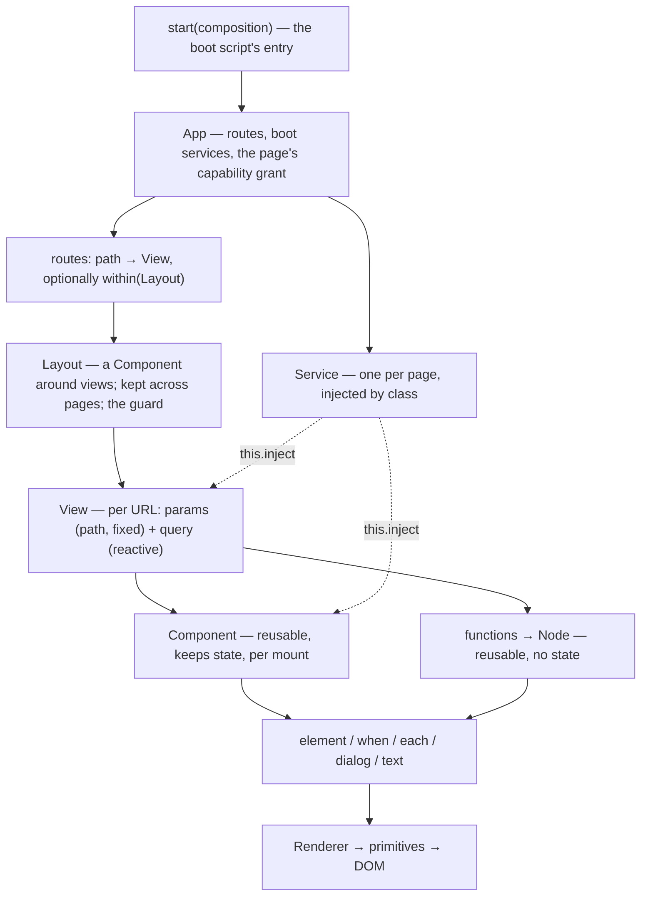

# @flybyme/mesh-web Documentation

> The browser half of the mesh framework.

A site is an **`App`**: a table of routes, the **`Service`**s that hold shared state and talk to
the API, the **`View`**s the routes show, and the **`Component`**s views are built from. The
kernel constructs every one of them. It renders the App as a single-page website, or as windows
on a desktop, from the same routes. Rendering is fine-grained and reactive: signals bind straight
to DOM text and attributes, with no virtual DOM.

**Start with [app-model.md](app-model.md)** (the design and every decision since).

**Build pages with [mesh-web-kit](../../mesh-web-kit)** (`@flybyme/mesh-web-kit`): the pieces
every site needs — page header, filter bar, data table, list rows, confirm button, forms built from
commands, loading and empty states — and its rules for writing more. mesh-web is the mechanism and
has no opinion about how a page looks; the kit is where that lives. The kit's `examples/console` is
the reference app: services, layouts, a guard, URL-held list state, and browser tests that click
through it (`npm run example:console` there, http://localhost:5191).

---

## The model in one picture


```mermaid
flowchart TD
    Start["start(composition) — the boot script's entry"] --> App
    App["App — routes, boot services, the page's capability grant"]
    App --> Services["Service — one per page, injected by class"]
    App --> Routes["routes: path → View, optionally within(Layout)"]
    Routes --> Layout["Layout — a Component around views; kept across pages; the guard"]
    Layout --> View["View — per URL: params (path, fixed) + query (reactive)"]
    View --> Component["Component — reusable, keeps state, per mount"]
    View --> Fn["functions → Node — reusable, no state"]
    Component --> Nodes["element / when / each / dialog / text"]
    Fn --> Nodes
    Nodes --> Renderer["Renderer → primitives → DOM"]
    Services -. "this.inject" .-> View
    Services -. "this.inject" .-> Component
```

- **Capabilities narrow going down.** The App's `needs(...)` is the page's grant; each unit's `needs`
  must fit inside its host's, and `this.cx` has exactly those keys, at compile time and at run time.
- **Commands are objects** on the unit that owns them — title, key, zod input, `run` — live while
  their owner is.
- **Every mount is an error boundary**: a unit that throws is replaced by the App's `fallback`.

## Invariants that have not changed

1. **No Node builtins.** `tsconfig.json` sets `"types": []`; importing `fs`, `path`, `crypto` or
   `process` does not compile.
2. **The browser never joins the mesh.** It speaks HTTP/SSE to an API gateway, through the
   generated, typed client (`cx.mesh`).
3. **One copy of the framework per page** (`assertSingleFramework`, `src/instance.ts`).
4. **Importing a module has no side effects**; the boot script hands the part's default export
   (the App class) to `start()`.
5. **No virtual DOM.**

---

## Guides

Status as of v0.21 (2026-09-29). **Current** means checked against the app model. **Partly stale**
means the subsystem is current but the guide still shows it being used from the deleted part model
(`Application`, `Extension`, `vx`, `cx.commands.implement`); each such guide says so at its top.

| Guide | What | Status |
|---|---|---|
| [App model](app-model.md) | The design, and §12–§24: every phase and finding since. | **Current** |
| [Reactivity](reactivity.md) | Signals, computeds, effects, batches, scopes, `resource`. | Current |
| [Networking & models](networking-and-models.md) | The typed client, staleness check, SSE, reactive CRUD collections. | Current |
| [Input & keyboard](input-and-keyboard.md) | Bindings, reserved chords, focus traps. | Current |
| [View & description layer](view-layer.md) | Description nodes, primitives, intents, `this.on`, functions vs components. | Current |
| [Testing](testing.md) | Browser tests: `mountSite`, `replace`, stand-in capabilities, waiting. | Current |
| [Kernel & boot](kernel-and-lifecycle.md) | `start()`, policies, the log viewer. | Partly stale |
| [Capabilities reference](capabilities-reference.md) | Every `cx.*` capability. | Partly stale |
| [Window & shell](window-management.md) | The desktop presentation: manager, tiling, frames. | Partly stale |
| [Settings & storage](settings-and-storage.md) | Hives, policies, namespaced storage. | Partly stale |
| [Driver architecture](driver-architecture.md) | Bridging to DOM-heavy subsystems (editors, terminals, canvas). | Stale — a design for the part model |
| [Workers & SSR](workers-and-ssr.md) | Headless processes and pre-rendering. | Stale — SSR's current plan is app-model.md §23 |

The part model's own guides (`contribution-model.md`, and `architecture.md`, its OS-style
overview of process tables and manifests) were deleted with the part model; they are in git
history.

---

## Package exports

```json
{
  "exports": {
    ".":                 "the whole public API — App, View, Service, Component, mountSite, start, …",
    "./net":             "the typed-client builders a generated client imports",
    "./testing":         "browser-test helpers",
    "./testing/config":  "definePartBrowserConfig() for vitest browser mode",
    "./kernel.css":      "structure only: the desktop, windows, notifications, the log panel",
    "./themes/dark.css": "an opt-in dark look for those widgets"
  }
}
```

The app model is exported from the root and nowhere else: a part's build keeps exactly one
specifier (`@flybyme/mesh-web`) external, so a subpath would bundle a second copy of the runtime.
