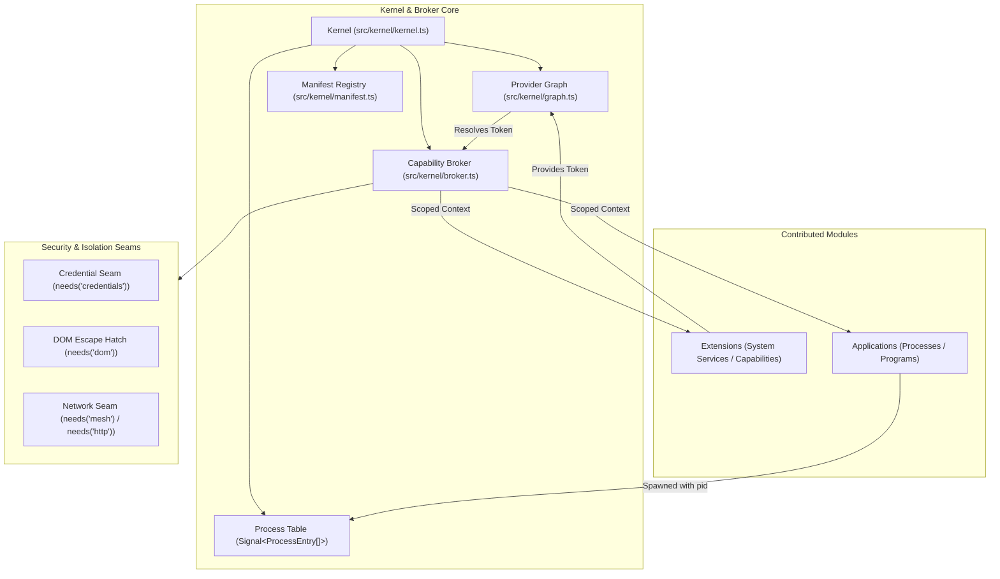
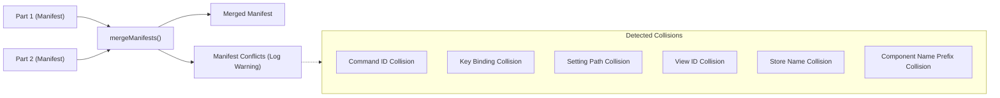

# Architecture Overview

`@flybyme/mesh-web` models the web browser runtime not as a traditional web page, but as an **abstract operating system**. In this model:
- The **Kernel** acts as the central supervisor and process manager.
- **Contributions** (Applications and Extensions) act as programs and system services.
- The **Capability Broker** acts as the system call boundary, granting narrowed, scoped capabilities to each contributor.
- The **Window Manager** and **Shell** orchestrate window placement, tiling, stacking, and viewport resizing.
- The **Renderer** compiles declarative description nodes into direct, reactive DOM mutations without virtual DOM diffing.

---

## The Abstract OS Model



---

## Core Subsystems

### 1. The Kernel ([`src/kernel/kernel.ts`](file:///home/ubuntu/code/mesh-web/src/kernel/kernel.ts))

The [`Kernel`](file:///home/ubuntu/code/mesh-web/src/kernel/kernel.ts#L64) class is the un-extensible supervisor. It cannot be wrapped, monkey-patched, or intercepted by plugins. It manages:
- **Manifest Merging**: Inspecting constructed parts before anything activates.
- **Provider Ordering**: Computing a topological sort of Extensions based on `consumes` and `provides` tokens.
- **Extension Activation**: Activating extensions in dependency order.
- **Process Management**: Spawning Application instances with unique kernel-assigned process IDs (`p1`, `p2`, ...).
- **Binding Verification**: Verifying at start that an Application binds exactly what it declared in `publishes` ([`checkBindings`](file:///home/ubuntu/code/mesh-web/src/contribution/api.ts#L254)).

### 2. The Capability Broker ([`src/kernel/broker.ts`](file:///home/ubuntu/code/mesh-web/src/kernel/broker.ts))

Capabilities represent the system resources a part may reach. The broker creates an isolated context ([`createContext`](file:///home/ubuntu/code/mesh-web/src/kernel/broker.ts#L358)) for each running instance. Two invariants hold:
1. **Narrowed**: An undeclared capability is absent from the context object. If a part declares `needs('log', 'commands')`, reaching for `cx.mesh` is a compile error and `undefined` at runtime.
2. **Scoped**: Capabilities are bound to the contributor asking for them. `cx.log` tags entries with the caller's identity; `cx.storage` namespaces keys by the declaring part; `cx.state` runs effects within a reactive scope that is cleaned up when the process terminates.

### 3. The Process Table ([`ProcessEntry`](file:///home/ubuntu/code/mesh-web/src/kernel/kernel.ts#L36))

Unlike frameworks where an application ID is synonymous with a single running instance, `@flybyme/mesh-web` assigns a unique `pid` to each running instance:

```ts
export interface ProcessEntry {
    readonly pid: string;               // e.g. "p1", "p2"
    readonly applicationId: string;     // Declaring ID, e.g. "catalog"
    readonly instance: number;          // 1-based instance counter
    state: ProcessState;                // 'starting' | 'running' | 'stopping' | 'stopped' | 'failed'
    readonly startedAt: number;         // Timestamp in ms
    error?: Error;
    api?: unknown;                      // Bound public PartApi
    internal?: unknown;                 // Private internal state for views
}
```

The process list is exposed as a reactive signal ([`kernel.processes`](file:///home/ubuntu/code/mesh-web/src/kernel/kernel.ts#L131)), allowing shells, taskbars, and devtools to observe running processes without polling.

---

## Contribution Model: Applications vs. Extensions

All code running on top of the kernel is packaged as a **Contribution** implementing [`Declarations`](file:///home/ubuntu/code/mesh-web/src/contribution/contract.ts#L247):

| Aspect | Extension ([`Extension`](file:///home/ubuntu/code/mesh-web/src/contribution/contract.ts#L395)) | Application ([`Application`](file:///home/ubuntu/code/mesh-web/src/contribution/contract.ts#L416)) |
|---|---|---|
| **Role** | System service / infrastructure provider | User program / process |
| **Instantiation** | Singleton per page | Multi-instance (or `singleton: true`) |
| **Lifecycle Method** | `activate(cx: Context)` | `async start(cx: Context)` / `async stop()` |
| **Identity** | Extension ID (e.g. `"theme"`, `"auth"`) | Kernel-assigned `pid` (`"p1"`, `"p2"`) |
| **Termination** | Never deactivated while the page is alive | Can be started, stopped, restarted independently |
| **Views** | None (cannot declare `views`) | Optional (declares zero or more views) |
| **Public Provider** | Can provide a [`ProviderToken<T>`](file:///home/ubuntu/code/mesh-web/src/contribution/provider.ts#L15) | Can provide a [`ProviderToken<T>`](file:///home/ubuntu/code/mesh-web/src/contribution/provider.ts#L15) |

---

## Static Manifest & Conflict Detection

Before running any code or mounting any DOM, the kernel inspects every part's constructed instance via [`mergeManifests`](file:///home/ubuntu/code/mesh-web/src/kernel/manifest.ts#L62). Manifest collisions are surfaced during boot:



- **Commands**: Command IDs are global across the page.
- **Key Bindings**: Chords are normalized ([`normalizeBinding`](file:///home/ubuntu/code/mesh-web/src/input/keys.ts#L141)). Two parts claiming `ctrl+k` collide. Chords reserved by the browser (e.g., `ctrl+w`, `ctrl+n`) are rejected at load time.
- **Components**: Contributed component names must be prefixed with the contributing part's ID (e.g., `ui.Button` or `catalog.Card`).
- **Conflict Handling**: The first claimant stands; the collision is logged as a structured warning in the kernel log buffer. Boot does not crash over a shortcut conflict.

---

## Provider Graph & Cycle Detection

Extensions declare dependencies using `consumes` and capabilities using `provides`:

```ts
const THEME = provider<ThemeApi>('theme');

class HighContrastExtension implements Extension<['state'], [], typeof THEME> {
    readonly provides = THEME;
    // ...
}

class ChromeExtension implements Extension<['chrome'], [typeof THEME]> {
    readonly consumes = consumes(THEME);
    // ...
}
```

The provider graph ([`src/kernel/graph.ts`](file:///home/ubuntu/code/mesh-web/src/kernel/graph.ts)) resolves activation order via topological sorting:
1. **Multiple Providers Forbidden**: If two extensions provide the same [`ProviderToken`](file:///home/ubuntu/code/mesh-web/src/contribution/provider.ts#L15), boot is immediately refused.
2. **Dependency Cycles Forbidden**: Cycles (e.g., $A \to B \to A$) throw a descriptive error naming the exact cycle path (`Provider cycle: a → b → a`). Lazy proxies are explicitly rejected because they create non-deterministic load orders.
3. **Graceful Cascade**: If an extension fails or its required provider is missing, only that extension and its downstream dependents are marked `failed`. Unrelated extensions and applications continue booting.

---

## Security & Isolation Seams

The framework enforces boundaries at compile time and runtime:

### 1. Network Seam: `needs('mesh')` vs. `needs('http')`
- [`mesh`](file:///home/ubuntu/code/mesh-web/src/net/client.ts#L86): Scoped specifically to the site's declared API contracts. Transparently attaches session bearer tickets via the credential seam.
- [`http`](file:///home/ubuntu/code/mesh-web/src/contribution/capabilities.ts#L305): Generic fetch for external endpoints (e.g., OAuth sign-in). **Never attaches credentials** (`credentials: 'omit'`), preventing accidental credential leakage to third-party domains.

### 2. Credential Seam: `needs('credentials')`
Only one extension on a page may hold the credential seam ([`Credentials.attach`](file:///home/ubuntu/code/mesh-web/src/contribution/capabilities.ts#L241)). If a second extension attempts to attach credentials, the kernel throws immediately, preventing credential interception.

### 3. DOM Escape Hatch: `needs('dom')`
The description layer contains no references to `HTMLElement` or DOM APIs. A part that requires direct DOM access (such as Monaco editor, Canvas, or WebGL) must explicitly declare [`needs('dom')`](file:///home/ubuntu/code/mesh-web/src/contribution/capabilities.ts#L337), rendering a [`Surface`](file:///home/ubuntu/code/mesh-web/src/contribution/capabilities.ts#L318) node. This makes DOM bypasses immediately visible in manifest audits and reviews.

### 4. Irreversible Confirmation Seam: `needs('confirmation')`
Destructive writes declare confirmation contracts. When automated agents or synthetic scripts drive the UI, actions requiring human confirmation ([`requiresUser: true`](file:///home/ubuntu/code/mesh-web/src/contribution/capabilities.ts#L374)) are automatically refused unless the actor is explicitly `'user'`, preventing automated bypasses of safety guards.
