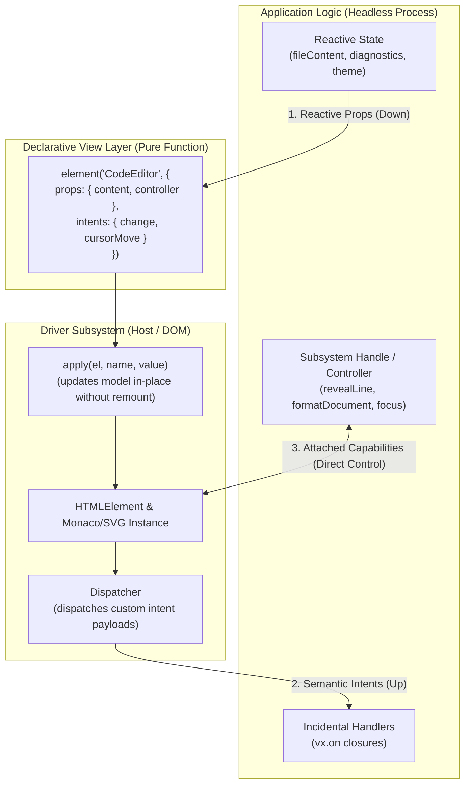
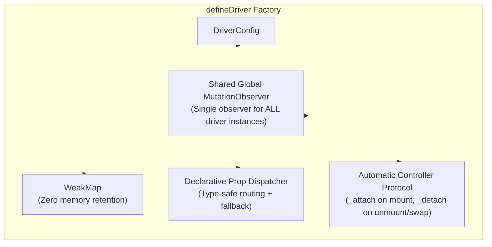

# Driver Architecture & Subsystem Bridging

> Bridging headless application logic and platform DOM subsystems (CodeEditor, Terminal, Canvas, WebGL, Charts).

In `@flybyme/mesh-web`, the kernel enforces strict layer boundaries:
- **Application Logic (`start(cx)` / `internal`)**: A long-lived, headless process owning signals, models, and commands. It has **zero DOM access**.
- **UI Descriptions (`render(vx)`)**: A pure function returning a serializable [`DescriptionNode`](file:///home/ubuntu/code/mesh-web/src/description/types.ts) tree (`element('CodeEditor', props)`). It cannot instantiate or hold an imperative DOM engine instance.
- **The Host / DOM Renderer ([`src/render/dom.ts`](file:///home/ubuntu/code/mesh-web/src/render/dom.ts))**: The sole layer where real browser elements exist.

This separation is essential for headless testing, security sandboxing, and renderer portability. However, complex subsystems like **`CodeEditor`** (Monaco / CodeMirror), **`Terminal`** (xterm.js), **`Charts`** (SVG engines), or **`Canvas`** (WebGL / Three.js) are **two-headed beasts**:
1. **The UI Surface (Host/DOM)**: Must mount into a physical `HTMLElement`, observe viewport/container resizes, layout glyphs and scrollbars, and handle keyboard/mouse events.
2. **The Subsystem Logic (Engine)**: Must be programmatically controlled by the application (e.g. streaming file content, setting LSP diagnostics, jumping to lines, running formatting, querying selections).

A **Driver** is the architectural construct that bridges this divide without violating kernel invariants.

---

## The 3 Communication Seams

Communication between an Application and a Driver occurs across three distinct vectors:



---

## Seam 1: Reactive State Down (App Logic $\to$ Driver UI)

The application passes reactive accessors or signals as props in the declarative tree. In [`src/render/dom.ts`](file:///home/ubuntu/code/mesh-web/src/render/dom.ts), `apply(el, name, value)` is called on creation and re-triggered whenever any signal updates:

```ts
if (isDynamic(value)) {
    effect(() => set(read(value)));
} else {
    set(value);
}
```

### In the Application View:
```ts
element('CodeEditor', {
    props: {
        content: () => file.content(),
        language: () => file.language(),
        markers: () => lsp.diagnostics(),
        readOnly: () => isLocked(),
    }
});
```

---

## Seam 2: Incidental Events Up (Driver UI $\to$ App Logic)

When the user interacts with the surface (typing, moving the cursor, clicking gutter breakpoints), the driver translates internal engine events into **Mesh Intents** with structured payloads.

[`src/render/dom.ts`](file:///home/ubuntu/code/mesh-web/src/render/dom.ts) checks for custom payload events via `isCustomPayloadEvent(e)` and unpacks `e.detail` into the intent dispatcher, which reaches [`vx.on()`](file:///home/ubuntu/code/mesh-web/src/contribution/contract.ts):

### Inside the Driver:
```ts
// Inside driver create():
editor.onDidChangeModelContent(() => {
    el.dispatchEvent(new CustomEvent('change', {
        bubbles: true,
        detail: {
            content: editor.getValue(),
            versionId: editor.getModel()!.getVersionId(),
        }
    }));
});

editor.onDidChangeCursorPosition((e) => {
    el.dispatchEvent(new CustomEvent('cursormove', {
        bubbles: true,
        detail: {
            line: e.position.lineNumber,
            column: e.position.column
        }
    }));
});
```

### In the Application View:
```ts
element('CodeEditor', {
    intents: {
        change: {
            action: vx.on((payload) => {
                internal.fileContent.set(payload.content);
                internal.markDirty();
            })
        },
        cursorMove: {
            action: vx.on((pos) => {
                internal.cursorPosition.set(pos);
            })
        }
    }
});
```

---

## Seam 3: Imperative Operations (App Logic $\to$ Driver Subsystem)

The central architectural challenge: **How does application logic invoke imperative methods (e.g. `revealLine(42)`, `formatDocument()`, `focus()`) when neither the application process nor the view holds the engine instance?**

In Mesh, this is solved via the **Inverted Controller / Handle Pattern**.

### 1. The Application Defines an Abstract Controller (Pure TypeScript)
The application defines a typed interface in its `internal` state with **zero DOM imports**:

```ts
export interface CodeEditorHandle {
    revealLine(line: number): void;
    formatDocument(): Promise<void>;
    focus(): void;
}

export interface CodeEditorController {
    readonly handle?: CodeEditorHandle;
    _attach(handle: CodeEditorHandle): void;
    _detach(): void;
}

export function createEditorController(): CodeEditorController & CodeEditorHandle {
    let attached: CodeEditorHandle | undefined;

    return {
        get handle() { return attached; },
        _attach(handle) { attached = handle; },
        _detach() { attached = undefined; },

        revealLine(line: number) {
            attached?.revealLine(line);
        },
        async formatDocument() {
            await attached?.formatDocument();
        },
        focus() {
            attached?.focus();
        }
    };
}
```

### 2. The View Passes the Controller to the Driver Node
```ts
// In the Application's render(vx) view function:
element('CodeEditor', {
    props: {
        controller: vx.internal.editorController,
        content: () => vx.internal.activeFile().content,
    }
});
```

---

## The Driver Abstraction: `defineDriver`

### The Problem with Raw `ComponentDefinition`

While [`ComponentDefinition`](file:///home/ubuntu/code/mesh-web/src/render/component.ts) provides the foundational `create(props)` and `apply(el, name, value)` interface, implementing rich drivers directly against it introduces severe pain points:

1. **Lifecycle & Teardown Vacuum**:
   `ComponentDefinition` has no `dispose(el)` or unmount hook. When an element is removed from the DOM (e.g. branch flips in `WhenNode`, window closures, or list removals), real DOM subsystems (Monaco, xterm, Chart resize observers) leak memory unless the driver manually tracks disconnects.
2. **The $O(N)$ MutationObserver Pitfall**:
   If every driver instance spawns its own `new MutationObserver(document.body)`, a page with 50 micro-charts or editors registers 50 concurrent DOM observers on `document.body`, causing severe layout thrashing and garbage collection spikes.
3. **Repetitive Wiring Boilerplate**:
   Every driver author must redundantly construct `WeakMap<Element, Instance>` registries, write manual `switch (name)` statements with untyped type assertions, and hand-roll controller `_attach` and `_detach` lifecycle guards.

### The Unified Solution: `defineDriver`

The **`defineDriver`** factory ([`mesh-core/src/driver/defineDriver.ts`](file:///home/ubuntu/code/mesh-core/src/driver/defineDriver.ts)) wraps `ComponentDefinition` into a high-level, declarative, and leak-proof specification.



### TypeScript Specification

```ts
export interface DriverConfig<
    TProps extends Record<string, any>,
    TInstance extends { element: Element; dispose?(): void },
    TController = unknown
> {
    /** The component name registered in the kernel vocabulary (e.g. 'CodeEditor', 'ChartSurface') */
    name: string;

    /**
     * Whether typing Space into this element counts as text entry rather than the 'activate' intent.
     */
    spaceIsTextInput?: boolean | ((el: Element) => boolean);

    /** Optional slot redirection if children are appended into a sub-container */
    slot?: (el: Element) => Element;

    /** Instantiate the real DOM instance and return it */
    create(props?: Partial<TProps>): TInstance;

    /**
     * Declarative prop update handlers.
     * Each handler is invoked when the corresponding prop updates.
     * Return value: handled automatically (returns true to the renderer).
     */
    apply?: {
        [K in keyof TProps]?: (instance: TInstance, value: TProps[K], el: Element) => void;
    };

    /**
     * Optional controller binding configuration.
     * Automatically handles _attach on mount, re-attaching on prop swaps, and _detach on unmount.
     */
    controller?: {
        propName?: keyof TProps; // Defaults to 'controller'
        getHandle: (instance: TInstance) => any;
    };

    /** Optional teardown callback invoked when the element is removed from the document */
    onDestroy?: (instance: TInstance, el: Element) => void;
}
```

---

## Core Pillars of `defineDriver`

### 1. Shared Global Lifecycle Engine
Rather than creating individual `MutationObserver` instances per component, `defineDriver` shares a **single lazy global observer**:
- **Zero Overhead Idle**: The observer attaches to `document.body` only when the first driver element mounts, and **disconnects completely** when all driver elements are removed.
- **Microtask-Deferred Registration**: Elements are verified inside `queueMicrotask` to ensure the host renderer has finished appending the node tree to `document`.
- **Automatic Cleanup**: When `!document.contains(el)` is observed:
  1. If a controller was attached, its `_detach()` method is invoked.
  2. The instance's `dispose()` method (if defined) is invoked.
  3. `config.onDestroy?.(instance, el)` is executed.
  4. The element is evicted from the live registry.

```ts
// Internal lifecycle manager
const liveElements = new Set<Element>();
const cleanupMap = new WeakMap<Element, () => void>();

let globalObserver: MutationObserver | undefined;

function ensureObserver(): void {
    if (globalObserver) return;
    globalObserver = new MutationObserver(() => {
        for (const el of liveElements) {
            if (!document.contains(el)) {
                liveElements.delete(el);
                const cleanup = cleanupMap.get(el);
                if (cleanup) {
                    cleanup();
                    cleanupMap.delete(el);
                }
            }
        }
        if (liveElements.size === 0 && globalObserver) {
            globalObserver.disconnect();
            globalObserver = undefined;
        }
    });
    globalObserver.observe(document.body, { childList: true, subtree: true });
}
```

### 2. Declarative Prop Routing
In raw `ComponentDefinition`, authors write long `switch (name)` statements with explicit type casts. With `defineDriver`, prop updates are mapped declaratively:

```ts
apply: {
    content: (inst, val) => inst.updateContent(String(val ?? '')),
    language: (inst, val) => inst.updateLanguage(val),
    readOnly: (inst, val) => inst.updateReadOnly(Boolean(val)),
    markers: (inst, val) => inst.updateMarkers(val ?? []),
}
```
Any prop listed in `apply` automatically returns `true`, signaling to the renderer that the prop was consumed. Any unlisted attribute (e.g. `class`, `style`, `id`, `aria-label`) returns `false`, gracefully falling back to [`applyDefaultProp()`](file:///home/ubuntu/code/mesh-web/src/render/component.ts).

### 3. Integrated Controller Protocol
When a driver specifies a `controller` configuration, `defineDriver` orchestrates the entire two-way handshake:
1. **At `create()`**: Extracts `props[controllerProp]` and calls `_attach(getHandle(instance))`.
2. **At `apply()`**: Detects if the controller prop changed to a new instance, cleanly detaching the old one and attaching the new one.
3. **At Unmount**: Calls `_detach()` immediately upon DOM removal, ensuring application commands (like `editor.revealLine()`) safely no-op instead of throwing on detached elements.

---

## Real-World Implementations

### Example 1: `CodeEditorDriver`

Implemented in [`mesh-core/src/CodeEditor/driver/driver.ts`](file:///home/ubuntu/code/mesh-core/src/CodeEditor/driver/driver.ts):

```ts
import { defineDriver } from '../../driver/index.js';
import type { CodeEditorController } from '../contract/handle.js';
import type { EditorMarker } from '../contract/types.js';
import { createEditorDom, type EditorDomInstance } from './editorDom.js';
import '../styles/editor.css';

export interface CodeEditorDriverProps {
    content?: string;
    language?: string;
    readOnly?: boolean;
    lineNumbers?: boolean;
    markers?: readonly EditorMarker[];
    controller?: CodeEditorController;
}

export const CodeEditorDriver = defineDriver<CodeEditorDriverProps, EditorDomInstance>({
    name: 'CodeEditor',
    spaceIsTextInput: true,

    create(_props) {
        return createEditorDom();
    },

    controller: {
        propName: 'controller',
        getHandle: (inst) => inst.handle,
    },

    apply: {
        content: (inst, val) => inst.updateContent(String(val ?? '')),
        language: (inst, val) => inst.updateLanguage(val !== undefined ? String(val) : undefined),
        readOnly: (inst, val) => inst.updateReadOnly(Boolean(val)),
        lineNumbers: (inst, val) => inst.updateLineNumbers(val !== false),
        markers: (inst, val) => inst.updateMarkers(val ?? []),
    },
});
```

### Example 2: `ChartDriver` (`ChartSurface`)

Implemented in [`mesh-core/src/Charts/driver/driver.ts`](file:///home/ubuntu/code/mesh-core/src/Charts/driver/driver.ts):

```ts
import { defineDriver } from '../../driver/index.js';
import type { ChartRenderPayload } from '../contract/types.js';
import { createChartDom, type ChartDomInstance } from './chartDom.js';
import '../styles/charts.css';

export interface ChartDriverProps {
    payload?: ChartRenderPayload;
}

export const ChartDriver = defineDriver<ChartDriverProps, ChartDomInstance>({
    name: 'ChartSurface',

    create(props) {
        return createChartDom(props?.payload);
    },

    apply: {
        payload: (inst, val) => {
            if (val) inst.update(val);
        },
    },
});
```

---

## Complete End-to-End Application Example

### Application Process (`src/app.ts`):
```ts
import { Application, Context, needs, signal } from '@flybyme/mesh-web';
import { createEditorController, type CodeEditorHandle } from './controller.js';

interface EditorInternal {
    fileContent: Signal<string>;
    cursor: Signal<{ line: number; column: number }>;
    editor: CodeEditorHandle;
    gotoLine(line: number): void;
}

export default class EditorApp implements Application<['state', 'windows'], [], undefined, any, EditorInternal> {
    readonly needs = needs('state', 'windows');

    async start(cx: Context<['state', 'windows']>): Promise<ApplicationStartResult<void, EditorInternal>> {
        const fileContent = cx.state.signal('// Welcome to Mesh');
        const cursor = cx.state.signal({ line: 1, column: 1 });
        const editor = createEditorController();

        const internal: EditorInternal = {
            fileContent,
            cursor,
            editor,
            gotoLine(line: number) {
                // Invoked from menu commands, keybindings, or search results:
                editor.revealLine(line);
                editor.focus();
            }
        };

        return { internal };
    }
}
```

### Application View (`src/views/editor.view.ts`):
```ts
import { ViewDecl, ViewContext, element, text } from '@flybyme/mesh-web';

export const editorView: ViewDecl<Record<string, never>, EditorInternal> = {
    id: 'editor',
    title: 'Code Editor',
    render(vx: ViewContext<Record<string, never>, EditorInternal>) {
        return element('Stack', {
            children: [
                // Top Action Toolbar
                element('Row', {
                    children: [
                        element('Button', {
                            intents: { activate: { action: vx.on(() => vx.internal.gotoLine(100)) } },
                            children: [text('Jump to Line 100')]
                        })
                    ]
                }),
                // The Subsystem Driver
                element('CodeEditor', {
                    props: {
                        controller: vx.internal.editor,
                        content: () => vx.internal.fileContent(),
                    },
                    intents: {
                        change: {
                            action: vx.on((payload) => vx.internal.fileContent.set(payload.content))
                        },
                        cursorMove: {
                            action: vx.on((pos) => vx.internal.cursor.set(pos))
                        }
                    }
                })
            ]
        });
    }
};
```

---

## Architectural Guarantees & Verification Matrix

| Invariant | Implementation Mechanism | Guarantee |
|---|---|---|
| **Zero DOM in App Logic** | Abstract controller interface + `defineDriver` | Application logic only imports and talks to typed handles (`CodeEditorHandle`). It never references `HTMLElement`, `window`, or DOM engines. |
| **Headless Testability** | Pure TypeScript interfaces & controllers | Applications can be unit-tested in Node/Vitest without JSDOM. The controller can be stubbed or asserted with standard test spies (`vi.fn()`). |
| **View Purity** | Declarative Description Trees | Views remain pure functions returning declarative `DescriptionNode` trees. The view never invokes methods on elements or holds handles. |
| **Shared Lifecycle & Teardown Safety** | Single Global `MutationObserver` in `defineDriver` | Elements automatically detach controllers and run `instance.dispose()` when removed from `document`. No memory leaks or dangling event handlers. |
| **Scalable Performance** | Shared observer with lazy activation | Exactly 1 `MutationObserver` on `document.body` regardless of how many instances mount (1, 50, or 1000). Observer disconnects completely when count drops to 0. |
| **Declarative Reactivity** | `apply` dictionary in `defineDriver` | Fine-grained signals update DOM instances in-place without tree remounts, cursor jumping, or layout resetting. |
| **Keyboard Accessibility** | `spaceIsTextInput` | Prevents the default `activate` intent on Space keypresses inside editors and text fields. |
