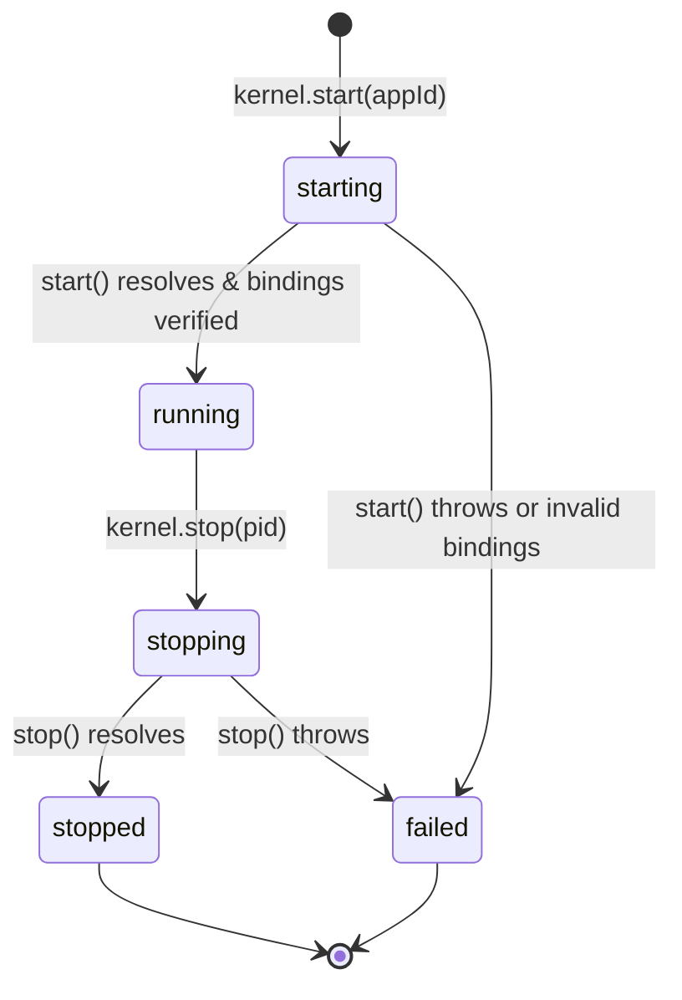

# Kernel & Boot Lifecycle

The kernel runtime is booted via the [`start(composition)`](file:///home/ubuntu/code/mesh-web/src/kernel/start.ts#L159) function. This replaces hand-written glue code with an automated, crash-resilient bootloader that wires together the window manager, settings hives, network client, component registries, page chrome, and hotkeys.

---

## The `Composition` Specification

A site's boot module hands a [`Composition`](file:///home/ubuntu/code/mesh-web/src/kernel/start.ts#L99) object to `start()`:

```ts
export interface PartRef {
    readonly id: string;
    readonly contribution: ErasedContribution | (new (...args: never[]) => ErasedContribution);
    readonly options?: unknown;
}

export interface Composition {
    /** Namespaces settings so two applications cannot collide in localStorage. */
    readonly application: string;
    /** Where requests are sent. '' means same-origin. Falls back to document `data-api`. */
    readonly api?: string;
    /** Frozen deployment settings that cannot be overwritten at runtime. */
    readonly policy?: BuildPolicy;
    /** The contributed parts (classes or instances). */
    readonly parts: readonly PartRef[];
    /** Where to mount. Created as #mesh-web-root if omitted. */
    readonly root?: Element;
    /** Applications to open at boot, and which views of each. */
    readonly open?: readonly { readonly application: string; readonly views?: readonly string[] }[];
    /** Optional test window injection. */
    readonly window?: { addEventListener(type: 'resize', fn: () => void): void };
    /** Custom hive bindings (system, user, device, session). */
    readonly hives?: HiveBindings;
    /** Maximum log entries before oldest are dropped (default: 1000). */
    readonly logCapacity?: number;
}
```

### The Return Value: `Started`

```ts
export interface Started {
    readonly kernel: Kernel;
    readonly manager: WindowManager;
    readonly page: Page;
    readonly settings: Registry;
    readonly components: ComponentRegistry;
    readonly logViewer: LogViewer;
    /** Resolves when all applications specified in `open` have completed async startup. */
    readonly ready: Promise<void>;
    /** Teardown: unmounts views, stops effects, removes event listeners, and disposes services. */
    dispose(): void;
}
```

> [!NOTE]
> `start()` returns **synchronously**, while `ready` is a **Promise**. The page chrome, window host, notification surface, and settings mount immediately so the user sees a responsive layout; slow application `start()` methods run asynchronously in the background.

---

## Detailed Step-by-Step Boot Lifecycle

```mermaid
sequenceDiagram
    autonumber
    participant Bootloader as start(composition)
    participant DOM as Browser DOM
    participant WM as WindowManager
    participant Hives as Settings Registry
    participant K as Kernel
    participant Ext as Extensions
    participant App as Applications

    Bootloader->>DOM: Mount #mesh-web-root (if not provided)
    Bootloader->>DOM: Read data-api attribute from <html>
    Bootloader->>WM: Initialize WindowManager (width, height)
    Bootloader->>Hives: Initialize Hives (system, user, device, session)
    Bootloader->>Hives: Resolve pageWindowMode ('windowed'|'tiled'|'single')
    Bootloader->>WM: windowPersistence.watch() (Debounced localStorage sync)
    Bootloader->>K: Construct loaded parts & call kernel.boot(loaded)
    Note over K: mergeManifests() detects collisions
    K->>Ext: resolveOrder() & activate extensions in dependency order
    Bootloader->>DOM: mountPage() renders chrome or window host
    Bootloader->>DOM: mountLogViewer() (ctrl+alt+q) & mountNotifications()
    Bootloader->>DOM: mountKeys() (bind default & declared shortcuts)
    Bootloader->>DOM: Measure host area & publish services.displaySize
    Bootloader-->>Bootloader: Return Started handle immediately
    
    rect rgb(20, 30, 45)
    Note over Bootloader,App: Async Ready Phase (open)
    Bootloader->>App: kernel.start(appId)
    Note over App: checkBindings() validates publishes
    Bootloader->>Hives: persistence.restore() restores window positions
    Bootloader->>WM: applyLayout() configures tiled split tree
    Bootloader->>K: summarise() logs boot outcome
    end
```



### Phase 1: Environment & Root Preparation
1. **Root Mounting**: If `composition.root` is omitted, the kernel appends `<div id="mesh-web-root" style="position:relative;width:100%;min-height:100%">` to `document.body`.
2. **API Discovery**: Reads `composition.api`, falling back to `document.documentElement.dataset.api ?? ''`.
3. **Display Size Measurement**: Measures the window host element `[data-mesh-window-host]`, writing the exact CSS pixels into the reactive signal [`services.displaySize`](file:///home/ubuntu/code/mesh-web/src/kernel/broker.ts#L127). A `ResizeObserver` ensures any layout changes update this signal automatically.

### Phase 2: Host Services & Settings Registry
1. **Hives Setup**: Binds four settings hives ([`defaultHives`](file:///home/ubuntu/code/mesh-web/src/kernel/broker.ts#L258)):
   - `system`: Memory provider, read-only.
   - `user`: Memory provider, writable (user preferences).
   - `device`: LocalStorage provider, writable (screen-specific geometry).
   - `session`: Memory provider, writable (per-session state).
2. **Policy Enforcement**: If `composition.policy` is set, overrides are locked into the registry before any setting is resolved.
3. **Window Persistence**: [`windowPersistence`](file:///home/ubuntu/code/mesh-web/src/window/persistence.ts#L105) activates its reactive watcher to debounce window moves and writes them to the `device` hive.

### Phase 3: Part Construction & Manifest Merging
1. **Constructor Isolation**: Iterates `composition.parts`. If a part's constructor throws, the error is recorded in the log buffer, and the remaining parts continue booting. A single broken constructor never brings down the page.
2. **Manifest Merging**: [`mergeManifests`](file:///home/ubuntu/code/mesh-web/src/kernel/manifest.ts#L62) inspects all declarations. Conflicts in command IDs, key chords, setting paths, view IDs, and store names are recorded.
3. **Component Registration**: Contributed components declared in manifests are registered into [`ComponentRegistry`](file:///home/ubuntu/code/mesh-web/src/render/component.ts#L47) alongside the 19 core [`PRIMITIVES`](file:///home/ubuntu/code/mesh-web/src/render/component.ts#L431).

### Phase 4: Extension Activation
1. **Topological Order**: [`resolveOrder`](file:///home/ubuntu/code/mesh-web/src/kernel/graph.ts#L34) computes the activation order.
2. **Context Creation**: Each extension receives an erased context ([`createContext`](file:///home/ubuntu/code/mesh-web/src/kernel/broker.ts#L358)) narrowed strictly to its declared `needs` and `consumes`.
3. **Activation**: The extension's `activate(cx)` runs. If it declares `provides`, its returned API is saved in the provider map. If `activate` throws, the extension is marked `failed` and logged; the boot sequence continues.

### Phase 5: Page Shell, Hotkeys & Diagnostics
1. **Page Mounting**: [`mountPage`](file:///home/ubuntu/code/mesh-web/src/window/page.ts#L104) checks if any extension provided [`PAGE_CHROME`](file:///home/ubuntu/code/mesh-web/src/window/page.ts#L101). If so, it renders the chrome description and finds the `[data-mesh-window-host]` element; otherwise it mounts directly into root.
2. **System Log Viewer**: Mounts the fullscreen log viewer ([`mountLogViewer`](file:///home/ubuntu/code/mesh-web/src/kernel/logs.ts#L177)) attached to the DOM root, toggled via `ctrl+alt+q`.
3. **Notifications**: Mounts `<div class="mesh-notifications">` rendering reactive entries from [`services.notifications`](file:///home/ubuntu/code/mesh-web/src/kernel/broker.ts#L112).
4. **Keymap**: [`mountKeys`](file:///home/ubuntu/code/mesh-web/src/kernel/start.ts#L721) binds built-in window commands and declared manifest bindings.

### Phase 6: Async Application Startup (`open`)
1. **Process Spawning**: For each application in `composition.open`, calls [`kernel.start(applicationId)`](file:///home/ubuntu/code/mesh-web/src/kernel/kernel.ts#L313).
2. **Binding Verification**: Runs [`checkBindings`](file:///home/ubuntu/code/mesh-web/src/contribution/api.ts#L254) to ensure declared `publishes` commands, components, and state match the actual returned `api`.
3. **View Opening**: Opens initial declared windows via [`kernel.services.windows.open(pid, view, {})`](file:///home/ubuntu/code/mesh-web/src/kernel/start.ts#L548).
4. **Geometry Restoration**: Reads remembered window coordinates from the `device` hive via [`persistence.restore()`](file:///home/ubuntu/code/mesh-web/src/window/persistence.ts#L162).
5. **Layout Application**: Applies declared split-tree layouts to the window manager ([`applyLayout`](file:///home/ubuntu/code/mesh-web/src/kernel/start.ts#L630)).
6. **Boot Summary**: Logs a single comprehensive boot summary line:
   ```
   booted 4 part(s) — running: chrome, catalog (p1), releases (p2) · failed: bad-part
   ```

---

## Process State Machine

An Application process moves through well-defined lifecycle states:



- **`starting`**: Process entry created in table with kernel-assigned PID (`p1`). Context instantiated.
- **`running`**: Application `start()` completed successfully. Published API verified. Windows may now render views.
- **`failed`**: Resting state for debugging. The process entry remains in the table with its `error` recorded, rather than vanishing silently.
- **`stopping` / `stopped`**: Context disposed, open windows closed, effects terminated, and commands unregistered.

---

## Logging Subsystem ([`src/kernel/logs.ts`](file:///home/ubuntu/code/mesh-web/src/kernel/logs.ts))

The kernel maintains a bounded in-memory log buffer:
- **Bounded Buffer**: Default capacity of 1,000 entries ([`createLogBuffer`](file:///home/ubuntu/code/mesh-web/src/kernel/logs.ts#L129)). Oldest entries are evicted cleanly without memory leaks.
- **Repeat Filtering**: Identical network call failures or capability refusals are deduplicated by [`RepeatFilter`](file:///home/ubuntu/code/mesh-web/src/kernel/logs.ts#L89) to prevent log flooding during render or polling loops.
- **Attribution**: Kernel lines record the affected part name in `LogRecord.part`.
- **Fullscreen Viewer**: Toggled by `ctrl+alt+q` or command `'kernel.logs'`. Provides level filtering (`all`, `error`, `warn`, `info`, `debug`), source filtering, text search, and eviction statistics.

---

## User Confirmation Subsystem ([`src/kernel/confirm.ts`](file:///home/ubuntu/code/mesh-web/src/kernel/confirm.ts))

When a capability invokes [`cx.confirmation.ask(options)`](file:///home/ubuntu/code/mesh-web/src/contribution/capabilities.ts#L399), the kernel renders a native `<dialog>` element via [`domConfirm`](file:///home/ubuntu/code/mesh-web/src/kernel/confirm.ts#L22):
- **Native Modal Semantics**: Uses `showModal()` to trap focus, make background elements inert, and handle Escape cancellation.
- **Attribution Display**: Displays `asked by <requester>` so the user knows which part triggered the request.
- **Actor Guard**: If `requiresUser === true` is specified, but the intent was raised by an automated agent or synthetic script (`actor !== 'user'`), the request is **immediately refused (`false`) without rendering**, preventing automated UI drivers from bypassing safety checks on destructive operations.
- **Fail-Safe Default**: If the document has no DOM or the dialog throws, the prompter safely resolves to `false` (refusal).
