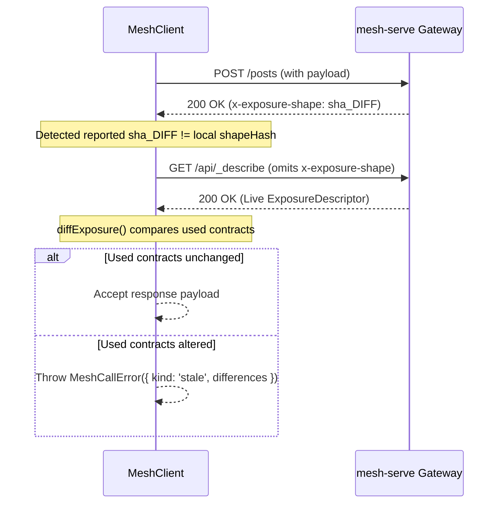

# Networking & Models

The networking and models subsystems provide typed, schema-verified communication between browser applications and the cluster's API gateway.

The networking client lives in [`src/net/`](file:///home/ubuntu/code/mesh-web/src/net/) and is exported as `@flybyme/mesh-web/net`. The reactive collections layer lives in [`src/models/`](file:///home/ubuntu/code/mesh-web/src/models/).

---

## 1. Declaring an API ([`src/net/api.ts`](file:///home/ubuntu/code/mesh-web/src/net/api.ts))

APIs are declared as structured values using [`defineApi`](file:///home/ubuntu/code/mesh-web/src/net/api.ts#L200) and [`call`](file:///home/ubuntu/code/mesh-web/src/net/api.ts#L186). These definitions are typically emitted by `mesh-serve client`:

```ts
import { defineApi, call } from '@flybyme/mesh-web/net';

export interface Post {
    readonly id: string;
    readonly title: string;
    readonly body: string;
}

export const BlogApi = defineApi({
    id: 'blog',
    exposure: 'exp_8f1b2c',
    shapeHash: 'sha_90a1f2',
    calls: {
        'post.find': call<void, readonly Post[]>('GET', '/posts'),
        'post.get': call<{ id: string }, Post>('GET', '/posts/:id'),
        'post.create': call<{ title: string; body: string }, Post>('POST', '/posts', {
            kind: 'role', role: 'author'
        }),
        'post.delete': call<{ id: string }, void>('DELETE', '/posts/:id', {
            kind: 'permission', permission: 'post:delete'
        }),
    },
    events: ['post.created', 'post.updated', 'post.deleted'],
});
```

### Phantom Types
`call<Input, Output, Errors>` uses phantom typing (`types?: { input, output, errors }`). The types travel with the value for compilation and IDE autocompletion, but add zero bytes to the runtime bundle.

### Path Parameter Interpolation ([`toRequest`](file:///home/ubuntu/code/mesh-web/src/net/api.ts#L215))
When calling endpoints with `:param` segments:
1. Segments (e.g. `/posts/:id`) are extracted and matched against fields in `input`.
2. Missing required parameters throw a descriptive error immediately on the client, rather than sending `:id` literally and receiving an ambiguous 404 from the router.
3. Path values are URL-encoded (`encodeURIComponent`).
4. Path parameters are consumed and omitted from the query string on `GET`/`DELETE` calls.

---

## 2. The Mesh Client ([`src/net/client.ts`](file:///home/ubuntu/code/mesh-web/src/net/client.ts))

The client is constructed via [`createClient`](file:///home/ubuntu/code/mesh-web/src/net/client.ts#L116):

```ts
import { createClient, fetchTransport, withHeaders } from '@flybyme/mesh-web/net';

const transport = withHeaders(
    fetchTransport('https://api.example.com'),
    () => ({ 'Authorization': `Bearer ${getTicket()}` })
);

const client = createClient(BlogApi, { transport });
```

### Invocation & Error Handling
`client.call(action, input)` throws [`MeshCallError`](file:///home/ubuntu/code/mesh-web/src/net/result.ts#L127) on failure, matching cluster-side invocation ergonomics:

```ts
try {
    const newPost = await client.call('post.create', {
        title: 'Announcing Mesh',
        body: '...'
    });
} catch (error) {
    if (error instanceof MeshCallError) {
        switch (error.error.kind) {
            case 'unauthorized':
                showLoginModal();
                break;
            case 'forbidden':
                showPermissionDenied();
                break;
            case 'stale':
                notifyApiDrift(error.error.differences);
                break;
            case 'invalid':
                showFormError(error.error.detail);
                break;
        }
    }
}
```

### Discriminated Failure Kinds ([`CallError`](file:///home/ubuntu/code/mesh-web/src/net/result.ts#L89))
- `unauthorized`: 401 response; user must authenticate.
- `forbidden`: 403 response; missing required role or permission.
- `not_found`: 404 response.
- `invalid`: 400 response with backend validation message.
- `conflict`: 409 response.
- `rate_limited`: 429 response.
- `server`: 500+ response with status and error message.
- `offline`: Transport failure (`Failed to fetch`).
- `stale`: API shape drift detected.
- `declared`: Explicit business logic failure declared by backend contract.

---

## 3. Staleness & Drift Protection

To prevent out-of-date clients from sending corrupted payloads, the client verifies the backend's contract shape:



### Shape Hash vs. Gate Hash
- `x-exposure`: Gating hash (changes per site based on role mappings).
- `x-exposure-shape`: Pure contract shape hash (contracts, methods, paths, and schemas).
- **Gate differences never fail a call**: A site gating a contract above `public` does not alter payload compatibility. The call proceeds, and the server enforces authentication natively. Only genuine schema or route shifts trigger `stale`.

---

## 4. Credentialed Server-Sent Events ([`src/net/eventsource.ts`](file:///home/ubuntu/code/mesh-web/src/net/eventsource.ts))

The browser's native `EventSource` class **cannot send headers**. For gated streams (e.g. `/events`), standard browser apps either fail or pass tokens in query strings (leaking credentials into proxy logs).

`@flybyme/mesh-web` solves this with [`createFetchEventSource`](file:///home/ubuntu/code/mesh-web/src/net/eventsource.ts#L54):

```ts
import { createFetchEventSource } from '@flybyme/mesh-web/net';

const es = createFetchEventSource('/events', {
    headers: () => ({
        'Authorization': `Bearer ${getTicket()}`
    }),
    retryDelay: 1000,
    maxDelay: 30000,
});

es.addEventListener('post.created', (event) => {
    console.log('Post created:', JSON.parse(event.data!));
});
```

- **Chunked Framing**: Decodes streaming chunks, handling multi-line data payloads, comments (`:keepalive`), and custom event types.
- **Exponential Backoff**: Automatically reconnects when connections close.

---

## 5. Reactive Models ([`src/models/`](file:///home/ubuntu/code/mesh-web/src/models/))

When a part declares `needs('models')` and an `api`, [`cx.models`](file:///home/ubuntu/code/mesh-web/src/models/types.ts#L102) provides typed reactive collections with live SSE synchronization:

```ts
// Open the 'post' collection:
const posts = cx.models('post');

// Read in a view description:
element('Text', {
    children: [
        when(
            () => posts.loading(),
            () => text('Loading posts...'),
            () => each(
                () => posts.rows(),
                post => post.id,
                post => element('Card', { children: [text(() => post().title)] })
            )
        )
    ]
});

// Mutate data:
await posts.create({ title: 'New Article', body: 'Content' });
await posts.delete({ id: '123' });
```

### Auto-Streaming Sync
If `BlogApi.events` declares events matching the collection prefix (e.g. `post.created`, `post.updated`, `post.deleted`), the model subscribes to the `/events` stream and automatically reconciles changes into the reactive `rows` signal in real-time.
