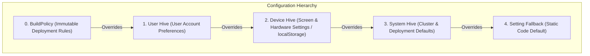

# Settings & Storage

`@flybyme/mesh-web` provides a layered configuration and persistence system divided into:
1. **The Settings Registry** ([`src/registry/`](file:///home/ubuntu/code/mesh-web/src/registry/)): A hierarchical four-hive configuration system supporting frozen deployment policies and runtime preferences.
2. **Contributor Storage** ([`src/storage/`](file:///home/ubuntu/code/mesh-web/src/storage/)): Scoped, namespaced key-value storage for Application state.

---

## 1. The Four Settings Hives ([`src/registry/hives.ts`](file:///home/ubuntu/code/mesh-web/src/registry/hives.ts))

Configuration settings belong to one of four isolated hives, matching how long and where the data should live:



| Hive | Backing Provider | Default Writable | Intended Purpose |
|---|---|---|---|
| `system` | `memoryProvider('system')` | `false` | Server-supplied configuration and cluster endpoints. |
| `user` | `memoryProvider('user')` | `true` | Account preferences that follow a signed-in user across devices. |
| `device` | `localProvider()` | `true` | Screen-specific hardware settings (e.g. window geometry, monitor mode) stored in `localStorage`. |
| `session` | `memoryProvider('session')` | `true` | Ephemeral state that disappears when the tab closes. |

---

## 2. Declaring and Reading Settings ([`src/registry/registry.ts`](file:///home/ubuntu/code/mesh-web/src/registry/registry.ts))

Settings are declared with strong typing, fallback defaults, and validation parsers:

```ts
import { setting, asString, asOneOf, asNumber } from '@flybyme/mesh-web';

export const editorTheme = setting<'dark' | 'light'>({
    path: 'editor/theme',
    hive: 'user',
    fallback: 'dark',
    description: 'Visual color theme for code editors',
    parse: asOneOf(['dark', 'light'] as const),
});
```

### Reading a Setting
Inside an Application or component, settings resolve reactively:

```ts
const registry = createRegistry({
    namespace: 'my-app',
    hives: defaultHives(),
});

// Resolve setting to a reactive signal:
const themeSignal = registry.get(editorTheme);
console.log(themeSignal()); // 'dark'

// Inspect full resolution metadata:
const res = registry.resolution(editorTheme)();
console.log(res.value);  // 'dark'
console.log(res.from);   // 'user' | 'device' | 'system' | undefined (fallback)
console.log(res.locked); // true if frozen by policy
```

### Writing a Setting
```ts
await registry.set(editorTheme, 'light');
```

---

## 3. Deployment Policies & `SettingLocked`

A deployment can freeze specific settings using [`BuildPolicy`](file:///home/ubuntu/code/mesh-web/src/registry/hives.ts#L43). For example, a blog can be locked permanently to single-window mode:

```ts
start({
    application: 'blog',
    policy: {
        'window-manager/mode': 'single',
    },
    parts: [/* ... */],
});
```

### Attempting to Mutate a Locked Setting
If code attempts to write to a setting governed by `policy`, or writes to a non-writable hive (`system`), the operation rejects with [`SettingLocked`](file:///home/ubuntu/code/mesh-web/src/registry/registry.ts#L107):

```ts
try {
    await registry.set(pageWindowMode, 'windowed');
} catch (error) {
    if (error instanceof SettingLocked) {
        console.warn(`Cannot change setting: ${error.message}`);
    }
}
```

---

## 4. Contributor Storage ([`src/storage/`](file:///home/ubuntu/code/mesh-web/src/storage/))

Applications that declare `needs('storage')` receive the [`cx.storage`](file:///home/ubuntu/code/mesh-web/src/storage/storage.ts#L28) capability.

```ts
const drafts = cx.storage.store<{ title: string; content: string }>('drafts', {
    hive: 'device',
});

// Write to storage:
await drafts.set('post_1', { title: 'Draft Post', content: '...' });

// Read from storage:
const item = await drafts.get('post_1');

// Delete entry:
await drafts.delete('post_1');

// Clear entire store:
await drafts.clear();
```

### Storage Invariants
- **Automatic Namespacing**: Keys are scoped under `<contributorId>:<storeName>:<key>`, preventing an Application from reading or modifying another part's storage.
- **Hive Backing**: Stores delegate persistence to the configured hive (`device` maps to `localStorage`, `session` maps to memory).
- **Automatic Lifecycle Teardown**: When an Application process stops, all open storage subscriptions and memory references are released by the kernel.
