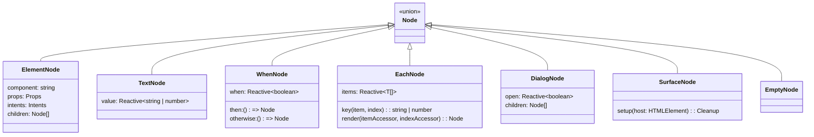

# View & Description Layer

The view layer in `@flybyme/mesh-web` separates UI intent from DOM mechanics. Rather than writing JSX that instantiates real DOM nodes or generates a virtual DOM tree that must be diffed, applications return pure declarative **description nodes** ([`src/description/`](file:///home/ubuntu/code/mesh-web/src/description/)).

The renderer ([`src/render/dom.ts`](file:///home/ubuntu/code/mesh-web/src/render/dom.ts)) compiles this description into direct DOM nodes, binding reactive signals to text nodes and attributes once at creation time.

---

## Core Invariants

1. **No DOM in Views**: Views never import `HTMLElement`, `Event`, or DOM APIs. A view is a pure function from application state to a description node.
2. **Extensible Vocabulary, Never Raw Tags**: Authors write `Stack`, `Row`, `Button`, or `Input` — never `<div>` or `<button>`. Primitives and extensions define how names translate to DOM elements.
3. **No Virtual DOM, No Diffing**: Re-evaluating a view does not construct a second tree to compare against the first. Signals wire directly to specific DOM nodes; when a signal updates, only the affected text node or attribute changes.

---

## Description Node Types ([`src/description/types.ts`](file:///home/ubuntu/code/mesh-web/src/description/types.ts))

The description tree is built using helper functions exported from `@flybyme/mesh-web`:



### 1. `element(component, options)` ([`src/description/build.ts`](file:///home/ubuntu/code/mesh-web/src/description/build.ts#L36))
Constructs a node from the component vocabulary:
```ts
element('Button', {
    props: { disabled: false },
    intents: { activate: { action: vx.on(() => save()) } },
    children: [text('Save Changes')]
});
```

### 2. `text(value)` ([`src/description/build.ts`](file:///home/ubuntu/code/mesh-web/src/description/build.ts#L48))
Renders text from a static string or a reactive signal:
```ts
text(() => `Status: ${status()}`);
```

### 3. `when(condition, then, otherwise?)` ([`src/description/build.ts`](file:///home/ubuntu/code/mesh-web/src/description/build.ts#L53))
Conditional branching. Unrendered branches are thunks and cost nothing until mounted:
```ts
when(
    () => isLoggedIn(),
    () => element('Text', { children: [text('Welcome back!')] }),
    () => element('Text', { children: [text('Please sign in.')] })
);
```

### 4. `each(items, keyFn, renderFn)` ([`src/description/build.ts`](file:///home/ubuntu/code/mesh-web/src/description/build.ts#L73))
Efficient keyed list reconciliation:
```ts
each(
    () => posts(),
    (post) => post.id,
    (post, index) => element('Card', {
        children: [text(() => `${index() + 1}. ${post().title}`)]
    })
);
```
> [!IMPORTANT]
> `item` and `index` in `renderFn` are **reactive accessors** (`() => T`, `() => number`), not raw values. When a list item is modified in-place with an unchanged key, the existing DOM row is preserved and only the inner signals update.

### 5. `dialog(options)` ([`src/description/build.ts`](file:///home/ubuntu/code/mesh-web/src/description/build.ts#L96))
Modal dialog with top-layer placement, focus trapping, and native backdrop semantics:
```ts
dialog({
    open: () => isModalOpen(),
    props: { title: 'Settings' },
    children: [/* ... */]
});
```

---

## Intents, Actions, and Handlers

In `@flybyme/mesh-web`, views do not handle raw DOM `MouseEvent` or `KeyboardEvent` instances. Instead, the renderer translates DOM events into semantic **Intents** ([`src/description/types.ts`](file:///home/ubuntu/code/mesh-web/src/description/types.ts#L86)):

| Intent | Trigger in Browser | Carried Value |
|---|---|---|
| `activate` | Click, Space key, Enter key | `undefined` |
| `change` | Text typing, checkbox toggle, slider move | `string`, `boolean`, or `number` |
| `commit` | Enter key in text input, form submit | Current input value |
| `dismiss` | Escape key, close button click | `undefined` |
| `context` | Right-click, Menu key, long press | Coordinates or item payload |
| `drop` | Drag-and-drop release | Dropped data payload |

### Actions: Commands vs. Handlers

An intent maps to an [`Action`](file:///home/ubuntu/code/mesh-web/src/description/types.ts#L45):
- **Command Action** (`{ kind: 'command', id: string }`): References a globally declared command present in the palette, keymap, and menu system.
- **Handler Action** (`{ kind: 'handler', id: string }`): Represents an incidental callback closure.

### The `Registrar` Pattern (`vx.on`)
To register an incidental closure while keeping the description serializable, views use `vx.on()` ([`Registrar`](file:///home/ubuntu/code/mesh-web/src/description/types.ts#L70)):

```ts
element('Input', {
    props: { value: () => search() },
    intents: {
        change: { action: vx.on((value) => search.set(String(value))) }
    }
});
```

The closure remains on the Application side inside a scoped [`HandlerTable`](file:///home/ubuntu/code/mesh-web/src/description/build.ts#L122); only an opaque ID (`"p1:0"`) travels into the description. When the view is closed, all registered handlers are automatically freed.

### Intent Actors (`IntentActor`)
To safeguard against automated UI abuse, raised intents carry an actor flag:
```ts
export type IntentActor = 'user' | 'agent' | 'part';
```
Destructive operations with `requiresUser: true` refuse automated agents automatically.

---

## The 19 Primitive Components ([`src/render/component.ts`](file:///home/ubuntu/code/mesh-web/src/render/component.ts))

The framework provides 19 built-in primitives:

| Component | HTML Tag | Key Behaviors & Accessibility |
|---|---|---|
| `Stack` | `<div>` | Vertical flex container with `gap` prop support. |
| `Row` | `<div>` | Horizontal flex layout. |
| `Text` | `<span>` | Inline text span. |
| `Heading` | `<h1>`-`<h6>` | Heading element dynamically mapped from `level` prop (1–6). |
| `Button` | `<button>` | Automatically sets `type="button"`, `aria-pressed`, `aria-expanded`, `aria-disabled`. |
| `Input` | `<input>` | Caret preservation (prevents cursor jumping mid-word while typing); dirty value/checked synchronization. |
| `TextArea` | `<textarea>` | Multiline input with caret preservation and dirty value handling. |
| `ScrollView` | `<div>` | Auto-scrolling (`autoScroll="bottom"`), dynamic scrollability tracking, keyboard accessibility via auto `tabindex=0`. |
| `Grid` | `<div>` | CSS Grid container supporting `columns`, `rows`, `gap`, `areas`. |
| `Divider` | `<hr>` | Horizontal or vertical divider with `data-orientation` and ARIA orientation. |
| `Span` | `<span>` | Formatted text supporting `bold`, `italic`, `code`, `color`, `size`. |
| `Form` | `<form>` | Container for form inputs. |
| `List` | `<ul>` | Unordered list. |
| `ListItem` | `<li>` | List item. |
| `Card` | `<section>` | Card container. |
| `Badge` | `<span>` | Status or count badge. |
| `Draggable` | `<div>` | Keyboard-accessible drag-and-drop; toggled via Space/Enter; manages `aria-grabbed`. |
| `DropZone` | `<div>` | Drop target for `Draggable`; supports `accepts` filtering and keyboard drop activation. |
| `Dialog` | `<dialog>` | Native modal dialog using `showModal()`, focus trapping, and background inertness. |

---

## Custom Components & Composites

Contributions can extend the vocabulary beyond the 19 primitives:

### Pure Component ([`defineComponent`](file:///home/ubuntu/code/mesh-web/src/contribution/api.ts#L323))
Stateless UI mapping props directly to a description node:

```ts
import { defineComponent, element, text } from '@flybyme/mesh-web';

export const UserAvatar = defineComponent<{ name: string; url?: string }>(
    'ui.UserAvatar',
    'Renders a user profile avatar or initials fallback',
    (props) => element('Row', {
        children: [text(props.name)]
    })
);
```

### Stateful Composite ([`defineComposite`](file:///home/ubuntu/code/mesh-web/src/contribution/api.ts#L337))
A component that owns internal state for as long as it is mounted:

```ts
import { defineComposite, element, text } from '@flybyme/mesh-web';

export const CounterButton = defineComposite<{ step: number }, { count: Signal<number> }>(
    'ui.CounterButton',
    'A self-contained increment button with internal count state',
    (props) => {
        const count = signal(0);
        return {
            count,
            view: () => element('Button', {
                intents: { activate: { action: vx.on(() => count.update(n => n + props.step)) } },
                children: [text(() => `Count: ${count()}`)]
            })
        };
    }
);
```

### Component Prefix Rule
All contributed components must be prefixed with the contributing part's identifier (`<partId>.<ComponentName>`). Unprefixed names collide with core primitives and are rejected during manifest merging.
