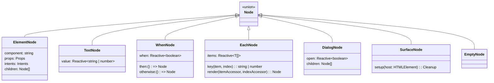

# View & Description Layer

The view layer in `@flybyme/mesh-web` separates UI intent from DOM mechanics. Rather than writing JSX that instantiates real DOM nodes or generates a virtual DOM tree that must be diffed, applications return pure declarative **description nodes** ([`src/description/`](file:///home/ubuntu/code/mesh-web/src/description/)).

The renderer ([`src/render/dom.ts`](file:///home/ubuntu/code/mesh-web/src/render/dom.ts)) compiles this description into direct DOM nodes, binding reactive signals to text nodes and attributes once at creation time.

---

## Core Invariants

1. **No DOM in Views**: Views never import `HTMLElement`, `Event`, or DOM APIs. A view is a pure function from application state to a description node.
2. **Extensible Vocabulary, Never Raw Tags**: Authors write `Stack`, `Row`, `Button`, or `Input` — never `<div>` or `<button>`. Primitives and extensions define how names translate to DOM elements.
3. **No Virtual DOM, No Diffing**: Re-evaluating a view does not construct a second tree to compare against the first. Signals wire directly to specific DOM nodes; when a signal updates, only the affected text node or attribute changes.

---

## Description Node Types ([`src/description/types.ts`](file:///home/ubuntu/code/mesh-web/src/description/types.ts))

The description tree is built using helper functions exported from `@flybyme/mesh-web`:


```mermaid
classDiagram
    class Node {
        <<union>>
    }
    class ElementNode {
        component: string
        props: Props
        intents: Intents
        children: Node[]
    }
    class TextNode {
        value: Reactive~string | number~
    }
    class WhenNode {
        when: Reactive~boolean~
        then: () => Node
        otherwise: () => Node
    }
    class EachNode {
        items: Reactive~T[]~
        key(item, index): string | number
        render(itemAccessor, indexAccessor): Node
    }
    class DialogNode {
        open: Reactive~boolean~
        children: Node[]
    }
    class SurfaceNode {
        setup(host: HTMLElement): Cleanup
    }
    class EmptyNode

    Node <|-- ElementNode
    Node <|-- TextNode
    Node <|-- WhenNode
    Node <|-- EachNode
    Node <|-- DialogNode
    Node <|-- SurfaceNode
    Node <|-- EmptyNode
```

### 1. `element(component, options)` ([`src/description/build.ts`](file:///home/ubuntu/code/mesh-web/src/description/build.ts#L36))
Constructs a node from the component vocabulary:
```ts
element('Button', {
    props: { disabled: false },
    intents: { activate: { action: this.on(() => save()) } },
    children: [text('Save Changes')]
});
```

### 2. `text(value)` ([`src/description/build.ts`](file:///home/ubuntu/code/mesh-web/src/description/build.ts#L48))
Renders text from a static string or a reactive signal:
```ts
text(() => `Status: ${status()}`);
```

### 3. `when(condition, then, otherwise?)` ([`src/description/build.ts`](file:///home/ubuntu/code/mesh-web/src/description/build.ts#L53))
Conditional branching. Unrendered branches are thunks and cost nothing until mounted:
```ts
when(
    () => isLoggedIn(),
    () => element('Text', { children: [text('Welcome back!')] }),
    () => element('Text', { children: [text('Please sign in.')] })
);
```

### 4. `each(items, keyFn, renderFn)` ([`src/description/build.ts`](file:///home/ubuntu/code/mesh-web/src/description/build.ts#L73))
Efficient keyed list reconciliation:
```ts
each(
    () => posts(),
    (post) => post.id,
    (post, index) => element('Card', {
        children: [text(() => `${index() + 1}. ${post().title}`)]
    })
);
```
> [!IMPORTANT]
> `item` and `index` in `renderFn` are **reactive accessors** (`() => T`, `() => number`), not raw values. When a list item is modified in-place with an unchanged key, the existing DOM row is preserved and only the inner signals update.

### 5. `dialog(options)` ([`src/description/build.ts`](file:///home/ubuntu/code/mesh-web/src/description/build.ts#L96))
Modal dialog with top-layer placement, focus trapping, and native backdrop semantics:
```ts
dialog({
    open: () => isModalOpen(),
    props: { title: 'Settings' },
    children: [/* ... */]
});
```

---

## Intents, Actions, and Handlers

In `@flybyme/mesh-web`, views do not handle raw DOM `MouseEvent` or `KeyboardEvent` instances. Instead, the renderer translates DOM events into semantic **Intents** ([`src/description/types.ts`](file:///home/ubuntu/code/mesh-web/src/description/types.ts#L86)):

| Intent | Trigger in Browser | Carried Value |
|---|---|---|
| `activate` | Click, Space key, Enter key | `undefined` |
| `change` | Text typing, checkbox toggle, slider move | `string`, `boolean`, or `number` |
| `commit` | Enter key in text input, form submit | Current input value |
| `dismiss` | Escape key, close button click | `undefined` |
| `context` | Right-click, Menu key, long press | Coordinates or item payload |
| `drop` | Drag-and-drop release | Dropped data payload |

### Actions: `this.on`

An intent maps to an [`Action`](../src/description/types.ts). In the app model it is a **handler
action** (`{ kind: 'handler', id }`), made by a view's or component's `this.on(fn)`:

```ts
element('Input', {
    props: { value: () => search() },
    intents: {
        change: { action: this.on((value) => search.set(String(value))) }
    }
});
```

The closure stays in a handler table; only an opaque id travels in the description, which keeps
the description serializable. The handler belongs to the instance that registered it and is
removed when that instance is disposed, so a view that comes and goes does not leak handlers
(`mountSite(...).handlerCount()` is the diagnostic).

A button that runs a **command** calls it from a handler — `this.on(() => void this.save.run())`.
Commands are objects on their owner (`command({ title, key, input, run })`, app-model.md §7). The
part model's `{ kind: 'command', id }` action still exists in the types as `commandAction`, but an
app-model site has nothing to dispatch it to and logs an error if one is pressed.

**Boolean props are HTML boolean attributes**: `true` makes the attribute present (as `""`),
`false` removes it. Select them with `[data-x]`, not `[data-x="true"]`; pass `String(flag)` if a
stylesheet needs the two values spelled out.

### Intent Actors (`IntentActor`)
To safeguard against automated UI abuse, raised intents carry an actor flag:
```ts
export type IntentActor = 'user' | 'agent' | 'part';
```
Destructive operations with `requiresUser: true` refuse automated agents automatically.

---

## The Primitive Components ([`src/render/component.ts`](../src/render/component.ts))

The built-in primitives (`PRIMITIVES`):

| Component | HTML Tag | Key Behaviors & Accessibility |
|---|---|---|
| `Stack` | `<div>` | Vertical flex container with `gap` prop support. |
| `Row` | `<div>` | Horizontal flex layout. |
| `Text` | `<span>` | Inline text span. |
| `Heading` | `<h1>`-`<h6>` | Heading element dynamically mapped from `level` prop (1–6). |
| `Button` | `<button>` | Automatically sets `type="button"`, `aria-pressed`, `aria-expanded`, `aria-disabled`. |
| `Input` | `<input>` | Caret preservation (prevents cursor jumping mid-word while typing); dirty value/checked synchronization. |
| `TextArea` | `<textarea>` | Multiline input with caret preservation and dirty value handling. |
| `ScrollView` | `<div>` | Auto-scrolling (`autoScroll="bottom"`), dynamic scrollability tracking, keyboard accessibility via auto `tabindex=0`. |
| `Grid` | `<div>` | CSS Grid container supporting `columns`, `rows`, `gap`, `areas`. |
| `Divider` | `<hr>` | Horizontal or vertical divider with `data-orientation` and ARIA orientation. |
| `Span` | `<span>` | Formatted text supporting `bold`, `italic`, `code`, `color`, `size`. |
| `Form` | `<form>` | Container for form inputs; `commit` fires on submit. |
| `Label` | `<label>` | `for` names the control it labels. |
| `Select` / `Option` | `<select>` / `<option>` | `value` is re-applied once the options exist; `change` carries the chosen value. |
| `Table`, `TableHead`, `TableBody`, `TableRow`, `TableHeaderCell`, `TableCell` | `<table>` … `<td>` | For tabular data; the semantics are what a screen reader reads. |
| `Link` | `<a>` | A real link. With `navigate`, a plain left click is the page's; modified clicks stay the browser's. Use the `Link` component, not the primitive. |
| `List` | `<ul>` | Unordered list. |
| `ListItem` | `<li>` | List item. |
| `Card` | `<section>` | Card container. |
| `Badge` | `<span>` | Status or count badge. |
| `Draggable` | `<div>` | Keyboard-accessible drag-and-drop; toggled via Space/Enter; manages `aria-grabbed`. |
| `DropZone` | `<div>` | Drop target for `Draggable`; supports `accepts` filtering and keyboard drop activation. |
| `Dialog` | `<dialog>` | Native modal dialog using `showModal()`, focus trapping, and background inertness. |

---

## Building above the primitives

`defineComponent` and `defineComposite` went with the part model. Above the primitives there are
now two things (app-model.md; the reference is `examples/console/src/ui`):

**A function returning nodes**, for anything with no state of its own:

```ts
export function emptyState(title: string, detail?: string): Node {
    return element('Stack', { props: { class: 'ui-empty' }, children: [
        element('Heading', { props: { level: 3 }, children: [text(title)] }),
        ...(detail === undefined ? [] : [element('Text', { children: [text(detail)] })]),
    ] });
}
```

**A `Component`**, for anything that remembers something, handles its own intents or needs a
service. Constructed per mount, disposed when its node leaves:

```ts
export class CounterButton extends Component({ props: props<{ readonly step: number }>() }) {
    readonly count = signal(0);

    render(): Node {
        return element('Button', {
            intents: { activate: { action: this.on(() => this.count.set(this.count() + this.props.step)) } },
            children: [text(() => `Count: ${this.count()}`)],
        });
    }
}

// in a view or another component:
this.mount(CounterButton, { step: 2 })
```

A component generic over a type (a table of any row) is a factory declared once per type at module
level — `const DomainTable = dataTable<Domain>()` — because a class cannot pass its own type
parameter to the `Component({...})` it extends.
