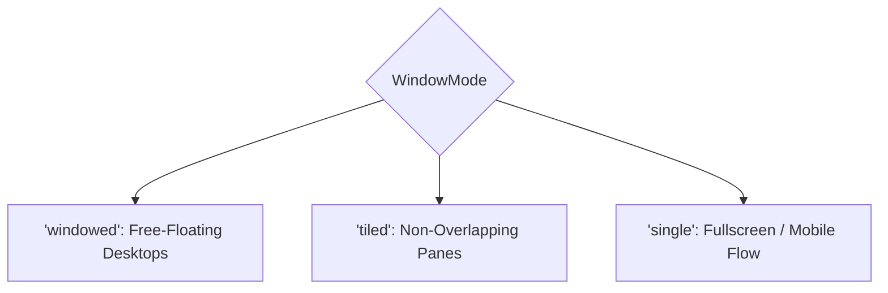

# Window & Shell Management

The window subsystem ([`src/window/`](file:///home/ubuntu/code/mesh-web/src/window/)) manages window geometry, multi-window tiling, viewport constraints, title bars, and geometry persistence.

---

## Core Invariant: Separation of Model, Presentation, and Chrome

The window architecture maintains strict separation between three layers:
1. **The Model ([`WindowManager`](file:///home/ubuntu/code/mesh-web/src/window/manager.ts#L103))**: Manages window records, stacking z-indices, split-tree tile allocations, and rectangular bounds. It knows nothing about DOM elements or CSS.
2. **The Shell ([`src/window/shell.ts`](file:///home/ubuntu/code/mesh-web/src/window/shell.ts))**: Renders frames, title bars, minimize/maximize buttons, and resize handles around views.
3. **The Chrome ([`src/window/page.ts`](file:///home/ubuntu/code/mesh-web/src/window/page.ts))**: An optional Extension that wraps the entire page with desktop furniture (dock, activity bar, status bar, or tabs).

---

## Window Modes

The window manager supports three distinct operational modes ([`WindowMode`](file:///home/ubuntu/code/mesh-web/src/window/manager.ts#L24)):



### 1. `windowed`
- Windows float freely over the desktop.
- Dragging by the title bar moves the window.
- Eight resize handles (`n`, `s`, `e`, `w`, `ne`, `nw`, `se`, `sw`) resize the frame.
- Clicking a window raises it to the top of the z-order stack.
- New windows cascade automatically across the screen ([`cascade`](file:///home/ubuntu/code/mesh-web/src/window/geometry.ts#L125)).

### 2. `tiled`
- Windows occupy non-overlapping rectangular panes within a split tree ([`LayoutNode`](file:///home/ubuntu/code/mesh-web/src/window/layout.ts#L30)).
- Panes are separated by a 1px divider gap ([`TILE_GAP = 1`](file:///home/ubuntu/code/mesh-web/src/window/manager.ts#L27)).
- If an Application declares no split tree, the window manager computes a balanced grid arrangement automatically via [`gridLayout(ids)`](file:///home/ubuntu/code/mesh-web/src/window/manager.ts#L81).

### 3. `single`
- One window occupies the entire viewport in ordinary document flow.
- Window decorations (title bar, resize grips, drop shadows) are stripped.
- Ideal for narrow viewports, mobile screens, or kiosk mode deployments.

---

## The Geometry Engine ([`src/window/geometry.ts`](file:///home/ubuntu/code/mesh-web/src/window/geometry.ts))

All geometry math is pure and testable without a DOM:

```ts
export interface Rect {
    readonly x: number;
    readonly y: number;
    readonly width: number;
    readonly height: number;
}

export type ResizeEdge = 'n' | 's' | 'e' | 'w' | 'ne' | 'nw' | 'se' | 'sw';
export type WindowState = 'normal' | 'minimized' | 'maximized';
```

- **`constrainToViewport(rect, viewport)`**: Clamps a window so its title bar is always visible and cannot be dragged off-screen.
- **`clampSize(size, min, viewport)`**: Enforces minimum dimensions (default $160 \times 100$px) and prevents windows from expanding beyond the available area.
- **`maximize(rect, viewport)`**: Calculates the maximal non-overflowing rect and preserves `restoreRect` so restoring returns the window to its exact prior coordinates.

---

## Page Chrome & The Window Host

When page chrome is present, it wraps the entire browser page and specifies where windows must live using the [`WINDOW_HOST`](file:///home/ubuntu/code/mesh-web/src/window/page.ts#L51) marker:

```ts
import { Extension, PAGE_CHROME, element, text, windowHost } from '@flybyme/mesh-web';

export default class WorkbenchChromeExtension implements Extension<['chrome'], [], typeof PAGE_CHROME> {
    readonly needs = needs('chrome');
    readonly provides = PAGE_CHROME;

    activate(cx: Context<['chrome']>) {
        return {
            render: () => element('Stack', {
                children: [
                    element('Row', { children: [text('My Application Titlebar')] }),
                    cx.chrome.host(), // <-- Inserts [data-mesh-window-host]
                    element('Row', { children: [text('Status: Ready')] })
                ]
            })
        };
    }
}
```

### Critical Sizing Invariant: Measuring Host, Not Root
In a page with chrome, the window area sits *below* the top navigation bar. If the window manager measured `#mesh-web-root`, maximized windows would extend beyond the bottom of the viewport by the height of the top bar.

The kernel measures the actual `[data-mesh-window-host]` element, updating the measurement dynamically via a `ResizeObserver` on the host element.

---

## Window Geometry Persistence ([`src/window/persistence.ts`](file:///home/ubuntu/code/mesh-web/src/window/persistence.ts))

Window coordinates, dimensions, and modes are remembered across browser reloads:

```ts
export interface RememberedWindow {
    readonly view: string;
    readonly x: number;
    readonly y: number;
    readonly width: number;
    readonly height: number;
    readonly state: WindowState;
}
```

### The `device` Hive Invariant
Geometry is persisted to the **`device` hive** (backed by `localStorage`), **never the `user` hive**:
- A laptop and a 32-inch desktop monitor have different screen resolutions. Sharing geometry across devices would position windows off-screen when moving between screens.
- Persisting to `device` prevents multi-device sync conflicts.

### Keyed by View, Never Window ID
Window IDs (e.g. `w1`, `w2`) are minted per session and cannot survive a reload. Persistence keys saved entries by the Application's stable **view identifier** (`view: 'main'`).

### Debounced Synchronization
Window drag and resize operations emit hundreds of events per second. [`windowPersistence.watch()`](file:///home/ubuntu/code/mesh-web/src/window/persistence.ts#L182) debounces writes (default 500ms) before committing to storage.

---

## The Window Sink ([`src/window/sink.ts`](file:///home/ubuntu/code/mesh-web/src/window/sink.ts))

The capability broker interacts with the window manager through an abstract [`WindowSink`](file:///home/ubuntu/code/mesh-web/src/kernel/broker.ts#L80). In real browser runs, this routes to `WindowManager`.

In unit and integration test environments without a DOM, the kernel defaults to [`recordingWindows()`](file:///home/ubuntu/code/mesh-web/src/kernel/broker.ts#L187), which records opened and closed windows in an in-memory array without throwing or touching the DOM.
