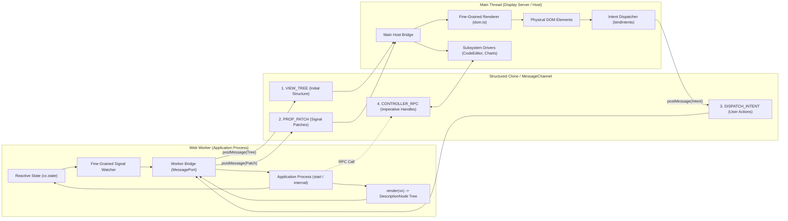
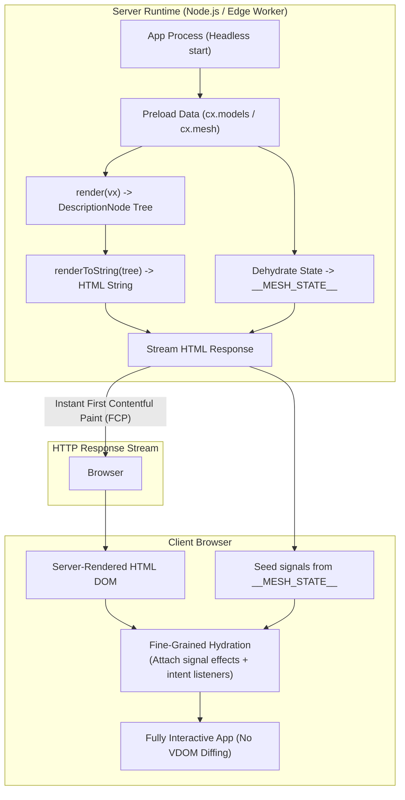

# Web Workers & Server-Side Rendering (SSR)

> Running headless application processes off the main thread and pre-rendering pure description trees on the server.

In traditional web frameworks, application state, business logic, component lifecycles, and DOM APIs are tightly coupled. Running off the main thread or on a server requires complex shims (like JSDOM), synthetic event pools, or heavy virtual DOM diffing engines.

`@flybyme/mesh-web` was designed from day one around three architectural invariants that make **Web Workers** and **Server-Side Rendering (SSR)** first-class primitives:
1. **Zero DOM in Application Logic**: Application processes ([`Application.start(cx)`](file:///home/ubuntu/code/mesh-web/src/contribution/contract.ts)) own reactive signals, models, and business logic without ever touching `window`, `document`, or `HTMLElement`.
2. **Views are Pure Functions**: Views ([`ViewDecl.render(vx)`](file:///home/ubuntu/code/mesh-web/src/contribution/contract.ts)) take a view context and return a serializable [`DescriptionNode`](file:///home/ubuntu/code/mesh-web/src/description/types.ts) tree. They never instantiate DOM nodes directly.
3. **No Virtual DOM, No Diffing**: Reactivity is fine-grained. Signals bind directly to specific target properties, eliminating the need to diff trees across threads or during hydration.

This establishes an **Operating System Display Server Model**: the application process runs headlessly (in a Web Worker or Node.js server), while the browser main thread acts as the display server and compositor (like Wayland or X11).

---

## 1. Web Worker Architecture (Off-Main-Thread Execution)

Moving an application into a Web Worker guarantees a **constant 60/120 FPS UI thread**. Heavy AST parsing, full-text indexing, language server requests, or massive JSON crunching cannot cause dropped frames or input stutter.



---

### The 4 IPC Seams Across the Worker Boundary

#### Seam 1: Serialized Description Trees (Worker $\to$ Main)
The description tree returned by `render(vx)` ([`src/description/types.ts`](file:///home/ubuntu/code/mesh-web/src/description/types.ts)) consists of plain, structured-cloneable JavaScript objects. Dynamic properties are assigned a unique reactive **Signal ID**:

```json
{
  "kind": "element",
  "component": "CodeEditor",
  "props": {
    "language": "typescript",
    "readOnly": false,
    "content": { "__mesh_signal": "sig_42" }
  },
  "intents": {
    "change": { "action": { "kind": "handler", "id": "h_onchange" } }
  }
}
```

#### Seam 2: Fine-Grained Signal Patches (Worker $\to$ Main)
Instead of re-transmitting the entire view tree when state updates, an `effect()` in the worker observes active signals and streams minimal value patches:

```ts
// Inside the Worker reactive scope:
for (const [signalId, accessor] of activeDynamicProps) {
    cx.state.effect(() => {
        const value = accessor();
        postMessage({ type: 'PROP_PATCH', signalId, value });
    });
}
```

On the main thread, the renderer applies the patch directly to the target element attribute or text node:
```ts
// On Main Thread:
case 'PROP_PATCH':
    const binding = liveSignalBindings.get(msg.signalId);
    binding?.update(msg.value); // In-place DOM mutation, zero VDOM diffing
    break;
```

#### Seam 3: User Intents & Event Dispatch (Main $\to$ Worker)
When the user interacts with the UI, the main thread's intent dispatcher ([`bindIntents`](file:///home/ubuntu/code/mesh-web/src/render/dom.ts)) unpacks the event and posts the intent payload:

```ts
// Main Thread Dispatcher:
function onIntent(action: Action, value?: IntentValue) {
    if (action.kind === 'handler') {
        worker.postMessage({
            type: 'DISPATCH_INTENT',
            handlerId: action.id,
            value,
        });
    }
}
```

The worker routes the payload to the application's handler closure (`vx.on(...)`), modifying the reactive signal inside the worker process.

#### Seam 4: Inverted Controller RPC (Bi-Directional)
Subsystem handles (such as [`CodeEditorHandle`](file:///home/ubuntu/code/mesh-core/src/CodeEditor/contract/handle.ts) for `revealLine`, `focus`, and `formatDocument`) are represented as asynchronous RPC proxies inside the worker:

```ts
// Inside the Worker:
const editorController: CodeEditorHandle = {
    revealLine(line: number) {
        workerPort.postMessage({ type: 'CALL_DRIVER', method: 'revealLine', args: [line] });
    },
    focus() {
        workerPort.postMessage({ type: 'CALL_DRIVER', method: 'focus', args: [] });
    }
};
```

---

### Capability Broker Narrowing in Workers

When running inside a Web Worker, capabilities are partitioned:

| Capability | Execution Location | Mechanism |
|---|---|---|
| **`cx.state`** | Worker Native | Full fine-grained reactive engine runs directly in the worker. |
| **`cx.mesh` / `cx.http`** | Worker Native | Native `fetch`, `EventSource`, and `WebSocket` execute in worker context. |
| **`cx.storage`** | Worker / Proxied | Uses IndexedDB directly, or proxies `localStorage` reads to main thread. |
| **`cx.log`** | Worker Native | Batches and formats logs, forwarding to the main thread log buffer. |
| **`cx.windows`** | Proxied (RPC) | Window management calls (`open`, `focus`, `close`) are forwarded to the main thread `WindowManager`. |
| **`cx.confirmation`** | Proxied (RPC) | Awaits user dialog confirmation from the main thread DOM surface. |

---

## 2. Server-Side Rendering (SSR) Architecture

Because `@flybyme/mesh-web`'s view layer has **zero DOM access**, the exact same application and view code executes on Node.js, Bun, Deno, or Cloudflare Workers without JSDOM or headless browsers.



---

### 1. The String Renderer (`renderToString`)

Instead of compiling to browser elements via `document.createElement`, a server-side renderer compiles the description tree to an optimized HTML string:

```ts
import type { DescriptionNode, Props } from '@flybyme/mesh-web';
import { read, isDynamic } from '@flybyme/mesh-web';

export function renderToString(node: DescriptionNode, options: SSRRenderOptions): string {
    switch (node.kind) {
        case 'empty':
            return '';

        case 'text':
            return escapeHtml(String(read(node.value)));

        case 'element': {
            const definition = options.components.get(node.component);
            const tag = definition?.ssrTag ?? 'div';
            const attrs = serializeAttributes(node.props);
            const inner = node.children.map((child) => renderToString(child, options)).join('');
            return `<${tag} class="mesh-${node.component.toLowerCase()}" ${attrs}>${inner}</${tag}>`;
        }

        case 'when': {
            const condition = Boolean(read(node.when));
            const branch = condition ? node.then() : (node.otherwise?.() ?? { kind: 'empty' });
            return renderToString(branch, options);
        }

        case 'each': {
            const items = read(node.items) as readonly unknown[];
            return items.map((item, index) =>
                renderToString(node.render(() => item, () => index), options)
            ).join('');
        }

        case 'dialog':
            // Hidden during initial SSR unless explicitly open
            if (!read(node.open)) return '';
            return `<dialog open>${node.children.map(c => renderToString(c, options)).join('')}</dialog>`;
    }
}
```

---

### 2. State Dehydration & Transfer Protocol

The server resolves initial data dependencies (such as active user credentials or initial file listings) and serializes the state into the document payload:

```html
<!DOCTYPE html>
<html lang="en" data-api="/api">
<head>
    <link rel="stylesheet" href="/dist/kernel.css">
    <link rel="stylesheet" href="/dist/ui.css">
</head>
<body>
    <div id="mesh-web-root">
        <!-- Pre-rendered semantic HTML markup -->
        <div class="mesh-stack" data-mesh-component="Stack">
            <div class="mesh-text">Welcome back, Alice</div>
        </div>
    </div>

    <!-- Embedded Initial State -->
    <script id="__MESH_STATE__" type="application/json">
        {
            "user": { "id": "u1", "name": "Alice" },
            "route": { "view": "catalog" }
        }
    </script>

    <script type="module" src="/dist/boot.js"></script>
</body>
</html>
```

---

### 3. Fine-Grained Hydration (Zero VDOM Diffing)

In React or Vue, hydration requires constructing a complete virtual DOM tree on the client and comparing every single virtual node against the server-rendered DOM. Any mismatch triggers console warnings and full tree rebuilds.

In Mesh, **hydration is fine-grained adoption**:
1. **Seed Signals**: Client boots and populates initial signals from `__MESH_STATE__`.
2. **Node Traversal**: The renderer walks the existing server DOM nodes.
3. **Bind Subscriptions**: It attaches fine-grained `effect()` listeners directly to existing text nodes and attributes.
4. **Attach Intent Listeners**: Binds event listeners (`click` $\to$ `activate`, `input` $\to$ `change`).
5. **Zero DOM Recreation**: Not a single DOM element is recreated or discarded.

---

## 3. Subsystem Drivers in Workers & SSR

Because drivers bridge real DOM engines (like Monaco, xterm.js, or SVG geometry), they require clear contracts for off-thread and server execution:

| Subsystem | SSR Strategy | Web Worker Strategy |
|---|---|---|
| **`Charts`** ([`mesh-core/src/Charts`](file:///home/ubuntu/code/mesh-core/src/Charts)) | **Full SSR (Native SVG)**<br>The math engine ([`src/Charts/math/`](file:///home/ubuntu/code/mesh-core/src/Charts/math/)) calculates pure SVG coordinates (`<path d="...">`). The server outputs complete, fully-rendered SVG charts with **0ms CLS**. | **Main Thread Driver**<br>The SVG DOM sits on the main thread; the worker computes math geometry and sends reactive coordinate updates. |
| **`CodeEditor`** ([`mesh-core/src/CodeEditor`](file:///home/ubuntu/code/mesh-core/src/CodeEditor)) | **Static Pre-Render Fallback**<br>The server outputs a syntax-highlighted `<pre class="mesh-editor-ssr"><code>...</code></pre>` block. The client swaps in the interactive editor upon boot. | **Main Thread Driver + Worker Controller**<br>Monaco mounts on the main thread; editor commands (`revealLine`, `formatDocument`) are proxied across the RPC seam. |
| **`Canvas` / WebGL** | **Placeholder Skeleton**<br>Outputs a themed canvas container. | **OffscreenCanvas**<br>The main thread transfers an `OffscreenCanvas` to the worker using `transferControlToOffscreen()`, allowing 120 FPS rendering off the main thread. |
| **`Terminal`** | **Shell Container**<br>Outputs a dark shell box with a terminal header. | **Main Thread Driver**<br>xterm.js mounts on the main thread; WebSocket and PTY stream buffers run in the worker. |

---

## 4. Architectural Comparison Matrix

| Property | Traditional React / Next.js | Mesh Web Worker Architecture | Mesh SSR Architecture |
|---|---|---|---|
| **Execution Thread** | Main UI Thread | Web Worker (Background) | Server Node.js / Edge Worker |
| **DOM Dependency** | Required in components | Zero DOM in Application Logic | Zero DOM in Views & Models |
| **UI Stutter Under Load** | Frequent (JS blocks event loop) | **Impossible** (Main thread is 100% free) | N/A (Pre-rendered on server) |
| **First Contentful Paint (FCP)** | Slow (Wait for client JS) | Medium (Client boots worker) | **Instant** (Server returns complete HTML) |
| **Hydration Cost** | Full VDOM reconstruction & diffing | N/A (Direct mounting) | **Zero VDOM diffing** (Fine-grained adoption) |
| **Hydration Failures** | Strict "Hydration Mismatch" errors | N/A | **Graceful** (Signals update in-place) |
| **Subsystem Isolation** | Component lifecycle hooks | Inverted Controller RPC | Pre-rendered SVG vs. Fallback HTML |
